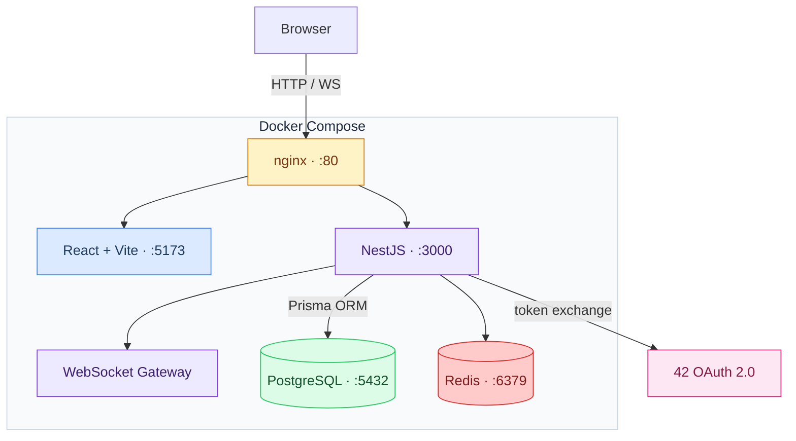

markdown
# 1. Pruebas de Encabezados
# H1 Grande
## H2 Normal
### H3 Sutil
#### H4 Pequeño
##### H5 Muy pequeño
###### H6 Mínimo

# 2. Énfasis y Estilos de Texto
*Este texto es cursiva con asteriscos.*
_Este texto es cursiva con guiones bajos._

**Este texto es negrita con asteriscos.**
__Este texto es negrita con guiones bajos.__

***Negrita e Italica combinadas***
~~Texto tachado (GFM)~~

**Negrita con _cursiva interna_** y viceversa.

# 3. Listas (Anidamiento y Mezcla)
* Elemento 1
* Elemento 2
    * Sub-elemento indentado (4 espacios)
    * Otro sub-elemento
        1. Lista numerada interna
        2. Segundo ítem
* Elemento 3 con `código embebido`

1. Uno
2. Dos
    - Mezclando viñetas dentro de números
    - Otro más
3. Tres
- [x] Hacer la compra :warning: :check:
- [ ] Comerse la comida :smile:
- [X] Evacuar la comida :wave:

# 4. Enlaces e Imágenes
[Enlace simple a Google](https://google.com)
[Enlace con título](https://google.com "Buscador de Google")
Enlace directo: <https://github.com>

Imagen con Alt Text:


# 5. Bloques de Código (Code Blocks)
`Código en línea (inline code)` con caracteres raros: `< > / \\ * _\`

```python
# Bloque de código con resaltado de sintaxis
def hola_mundo():
    print("Hola, Markdown Engine!")
    return True
```

| Layer | Technology | Version |
|-------|-----------|---------|
| Backend | NestJS | 11 |
| Frontend | React + Vite | 19 / 6 |
| Language | TypeScript strict | 5.7 |
| ORM | Prisma | 7 |
| Database | PostgreSQL | 16 |
| Cache / Pub-Sub | Redis | 7 |
| Package manager | pnpm workspaces | 10 |
| Reverse proxy | nginx | — |
| Containerization | Docker Compose | — |
| Styling | SCSS design system | — |

> [!tip] tip
> Keep working on the MVP

> [!note] note
> Finish the MVP

> [!error] error
> The MVP is not finished

> [!faq] faq
> FAQ me

> [!todo] todo
> Finish the MVP

> [!example] example
> Example me that MVP



