# DOSSIER DE PROJET - Développeur web et web mobile

## Remerciements

Je remercie les formateurs, encadrants et personnes qui ont accompagné la réalisation de ce projet, que ce soit par leurs retours, leurs conseils techniques ou leur suivi méthodologique. Leur accompagnement m'a aidé à structurer le dossier, à prendre du recul sur les choix réalisés et à relier les développements aux compétences attendues du titre professionnel.

Je remercie également les membres de l'équipe projet pour les échanges autour de l'expérience utilisateur, des besoins métier et des choix d'architecture. Ces discussions ont permis d'améliorer la cohérence de Prismatica et de mieux articuler la partie front-end, la partie back-end et les enjeux de sécurité.

Enfin, je remercie les personnes qui prendront le temps d'étudier ce dossier. Il présente un projet ambitieux, pensé non seulement comme une application, mais aussi comme une plateforme réutilisable capable de soutenir plusieurs usages professionnels autour de la donnée.

<div class="page-break"></div>

## Résumé

Prismatica est une application web destinée aux organisations qui souhaitent mieux structurer, visualiser et exploiter leurs données. Le projet répond à un besoin fréquent : les informations métier sont souvent dispersées dans des fichiers, des exports, des bases SQL, des documents ou des outils internes qui communiquent peu entre eux. Cette fragmentation ralentit les équipes et limite la production de tableaux de bord fiables.

La solution proposée combine une interface de gestion de données, un système de dashboards et une infrastructure back-end réutilisable de type BaaS. L'utilisateur peut créer des collections, définir des champs, organiser des vues, composer des indicateurs et publier certaines interfaces. Le back-end apporte l'authentification, les permissions, le routage API, l'accès contrôlé aux bases, le stockage, le temps réel et l'observabilité.

Mon travail a porté principalement sur l'architecture technique, la conteneurisation, la sécurité applicative, l'intégration des services et la structuration d'un socle capable d'évoluer vers plusieurs cas d'usage. Le projet démontre ainsi une approche complète : concevoir une application utile aux utilisateurs métier, tout en construisant une base technique robuste, sécurisée et industrialisable.

<div class="page-break"></div>

## Introduction

Les entreprises produisent et manipulent de plus en plus de données, mais ces données restent souvent difficiles à exploiter. Elles sont dispersées, peu structurées ou dépendantes d'outils qui ne correspondent pas toujours aux usages réels des équipes. Cette situation crée un écart entre la donnée disponible et la capacité des utilisateurs métier à la transformer en décisions, en tableaux de bord ou en interfaces opérationnelles.

Prismatica est né de ce constat. L'objectif est de proposer une application web permettant de créer des collections, de configurer des vues, de composer des dashboards et de publier certaines interfaces sans reconstruire un back-end spécifique à chaque besoin. Le projet s'inscrit donc à la fois dans une logique produit, orientée expérience utilisateur, et dans une logique d'infrastructure, orientée sécurité, modularité et réutilisation.

Ce dossier présente les choix réalisés pour concevoir cette solution : l'organisation fonctionnelle de l'application, les interfaces front-end, l'architecture back-end, les mécanismes de sécurité, les jeux d'essai et les limites identifiées. Il met en évidence la manière dont Prismatica cherche à rendre la donnée plus accessible aux utilisateurs, tout en conservant un socle technique maîtrisé et professionnel.

<div class="page-break"></div>

## CHAPITRE 1. Synthèse des compétences mobilisées

La réalisation du projet **Prismatica**, une application de gestion de bases de données et de création de dashboards pour les entreprises, a mobilisé un large éventail de compétences techniques et méthodologiques. Mon intervention a porté sur la conception d'une solution robuste, sécurisée et optimisée pour un usage professionnel principalement desktop.

Mon travail s'est réparti entre la conception d'interfaces utilisateur, la mise en place de l'infrastructure de données, la définition des règles de sécurité et la construction d'une logique back-end générique capable de soutenir plusieurs cas d'usage métier.

> Activité type n°1 : Développer la partie front-end d'une application web ou web mobile sécurisée.

**Conception des interfaces utilisateur (maquetter)** : j'ai initié le projet par la création de maquettes et de parcours utilisateurs. Ces supports ont permis de définir l'expérience utilisateur, la hiérarchie des écrans et les interactions principales : création de collections, configuration de vues, composition de dashboards et gestion des permissions. Dans le contexte de Prismatica, une approche **desktop first** a été privilégiée, car l'application manipule des tableaux, graphiques, formulaires complexes et interfaces de configuration qui sont plus adaptés à un écran large. Le responsive design reste néanmoins prévu afin de permettre la consultation et certains usages simples sur tablette ou mobile.

**Intégration des interfaces statiques (réaliser)** : j'ai structuré l'application avec du HTML sémantique et du SCSS afin d'obtenir une base lisible, maintenable et cohérente. Les composants ont été pensés pour être réutilisables : cartes, tableaux, formulaires, panneaux latéraux, modales et widgets de dashboard.

**Développement de l'interactivité (développer la partie dynamique)** : j'ai utilisé **React** pour rendre l'interface dynamique. Mon rôle a consisté à gérer les appels asynchrones vers l'API, les états de chargement, les formulaires réactifs, les retours d'erreur, les mises à jour conditionnelles de l'interface et la préparation des interactions nécessaires au builder de données et de dashboards.

> Activité type n°2 : Développer la partie back-end d'une application web ou web mobile sécurisée.

BaaS signifie **Backend as a Service**. Il s'agit d'une infrastructure back-end préconfigurée qui fournit des briques communes : authentification, stockage, API, permissions, temps réel, fichiers, emails et observabilité. Dans Prismatica, cette approche permet de concentrer l'effort produit sur la gestion des données et l'expérience utilisateur, tout en s'appuyant sur une plateforme technique réutilisable. J'ai structuré le back-end comme une **usine à backends génériques**, capable de fournir des services standardisés sans recoder une API métier complète pour chaque nouveau projet.

**Modélisation de la base de données** J'ai conçu le schéma de la base de données relationnelle **PostgreSQL** pour stocker les données de l'application, en veillant à la normalisation et à l'optimisation des requêtes. J'ai également utilisé **MongoDB** pour certaines fonctionnalités nécessitant une flexibilité accrue dans la gestion des données. La modélisation a permis de structurer les données de manière efficace, facilitant ainsi les opérations de lecture et d'écriture en définissant des relations claires entre les différentes entités de l'application et les contraintes d'intégrité.

**Élaboration des composants d'accès aux données** : j'ai développé des composants permettant d'interagir avec les bases de données à travers des services contrôlés. La gateway `Kong` centralise les accès publics, tandis que les services internes appliquent les permissions et routent les requêtes vers PostgreSQL, MongoDB ou les adapters nécessaires. Des mécanismes de cache et de supervision ont également été intégrés pour améliorer la performance et la fiabilité. Le moteur `Trino` est réservé aux usages analytiques et aux requêtes fédérées, afin de ne pas alourdir le chemin critique des opérations CRUD.

## CHAPITRE 2. Présentation du projet

### Présentation de l'entreprise

Le projet **Prismatica** s'inscrit d'abord dans un contexte d'apprentissage et de collaboration entre étudiants de l'école **42**. À l'origine, un groupe d'étudiants s'est réuni autour du projet **Transcendance**, un projet ouvert qui pousse à concevoir une application web complète, avec authentification, temps réel, interfaces utilisateur, base de données et déploiement. Ce cadre nous a amenés à réfléchir au-delà du besoin immédiat : comment construire plus vite des interfaces fiables lorsque les données, les droits et les tableaux de bord deviennent complexes ?

Cette réflexion a fait apparaître un problème qui existait déjà dans de nombreux contextes : les données métier sont souvent dispersées entre des tableurs, des exports, des bases SQL, des documents, des outils internes ou des applications vieillissantes. Il existe déjà des solutions reconnues pour gérer, visualiser ou centraliser ces informations. L'objectif n'était donc pas de prétendre inventer un besoin nouveau, mais de créer notre propre solution, à notre manière, en combinant gestion de données, dashboarding, permissions et infrastructure back-end réutilisable.

Prismatica est né de cette volonté : transformer une problématique rencontrée pendant un projet étudiant en une plateforme plus générique. Le projet vise à permettre à une équipe de structurer ses données, créer des vues, composer des dashboards et publier certaines interfaces, sans devoir reconstruire une API complète pour chaque nouveau cas d'usage.

Pour garder un dossier lisible, le contenu est organisé par grands blocs : une partie front-end centrée sur l'expérience utilisateur, une partie back-end centrée sur le socle BaaS, puis une partie plus transversale pour le cahier des charges, l'infrastructure, la sécurité, les choix d'architecture et les limites. Quand une explication peut être remplacée par un schéma, le dossier privilégie le diagramme afin d'économiser du texte et de rendre la lecture plus rapide pour le jury.

Dans ce projet, mon rôle a été de concevoir une solution capable de répondre à deux enjeux complémentaires :

- offrir une interface de gestion de données compréhensible par des utilisateurs non développeurs ;
- fournir une infrastructure back-end robuste, sécurisée et réutilisable, capable de supporter des données relationnelles, documentaires, temps réel et des règles d'accès avancées.

Prismatica n'est donc pas seulement un outil de visualisation. C'est une application de **database management orientée métier** : elle permet de créer des collections, de structurer des champs, de visualiser les informations sous plusieurs formes, de composer des dashboards et de publier certaines vues dans une page web ou dans un espace applicatif autonome.

L'infrastructure mini-BaaS développée autour du projet apporte la couche technique nécessaire : authentification, API gateway, base relationnelle, base documentaire, permissions, routage des requêtes, stockage, observabilité et déploiement Dockerisé.

### Cahier des charges du projet

#### contexte et objectifs

Le projet **Prismatica** vise à développer une application web permettant aux entreprises de créer, organiser, visualiser et exploiter leurs données sans dépendre systématiquement d'un développeur pour chaque modification d'interface, de structure ou de tableau de bord.

Le besoin initial vient d'un constat fréquent en entreprise : les équipes métier manipulent quotidiennement des informations importantes, mais ces informations sont souvent stockées dans des outils non reliés entre eux. Les données peuvent être présentes dans des fichiers CSV, des tableurs, des exports logiciels, des bases SQL, des documents ou des applications internes anciennes. Cette fragmentation rend les processus plus lents, complique la collaboration et limite la capacité à produire des dashboards fiables.

Prismatica répond à ce problème avec une interface web visuelle et user-friendly. L'utilisateur peut créer un projet, définir ses collections comme dans une base de données, ajouter des champs typés, importer des données, construire des vues, composer des dashboards et publier certaines interfaces sous forme de page autonome ou de composant intégré dans un site existant.

Le positionnement est volontairement hybride :

- une couche **database management** pour structurer les données ;
- une couche **CMS métier** pour créer des interfaces adaptées à un usage opérationnel ;
- une couche **dashboarding** pour visualiser les indicateurs ;
- une couche **adapter/embed** pour exposer une vue, un formulaire, un endpoint ou un widget à l'extérieur ;
- une couche **permissions** pour contrôler précisément qui peut voir, modifier, publier ou administrer chaque ressource.

L'enjeu principal est l'autonomie. Un manager, un responsable métier ou un collaborateur formé doit pouvoir faire évoluer son espace de travail, ajouter un tableau, modifier une vue, filtrer des données ou publier un dashboard sans attendre une intervention technique lourde. Les développeurs restent nécessaires pour l'infrastructure, les intégrations complexes et la sécurité, mais les ajustements métier courants deviennent accessibles aux utilisateurs autorisés.

Les objectifs du projet sont donc les suivants :

- centraliser les données d'un projet ou d'une équipe dans un espace sécurisé ;
- permettre la création de schémas de données visuels et compréhensibles ;
- proposer plusieurs représentations d'une même donnée : tableau, graphique, KPI, calendrier, kanban ou carte ;
- créer rapidement des dashboards utilisables en interne, en démonstration client ou intégrés dans une page web ;
- rendre les utilisateurs métier plus autonomes dans l'organisation de leurs données ;
- garantir la traçabilité, la sécurité et la séparation des accès ;
- fournir une base technique réutilisable pour d'autres applications métiers.

#### objectifs du projet et choix architecturaux

Le projet poursuit un objectif produit et un objectif technique.

Sur le plan produit, Prismatica doit permettre de créer des applications de données rapidement : un utilisateur définit un modèle, crée des vues, assemble une interface, partage un dashboard et forme ses collègues à l'utiliser. La même donnée peut servir plusieurs usages sans duplication : suivi interne, reporting direction, widget public, formulaire, export ou API.

Sur le plan technique, le back-end ne devait pas être limité à un seul métier ou à un seul modèle de données. Il devait rester générique, sécurisé et extensible. C'est pourquoi l'architecture a été pensée comme une plateforme **BaaS** auto-hébergée, orientée Docker Compose, capable de fournir des briques réutilisables : authentification, données relationnelles, données documentaires, requêtage multi-tenant, temps réel, stockage objet, email transactionnel, logs, métriques et politiques de sécurité unifiées.

Les principes retenus sont les suivants :

- le SDK et l'interface front-end expriment une intention utilisateur ;
- la gateway sécurise l'entrée publique et applique les contrôles transverses ;
- le back-end reste l'autorité pour les permissions et l'exécution des requêtes ;
- le `query-router` orchestre les accès SQL/NoSQL sans exposer directement les bases ;
- le `permission-engine` applique les règles RBAC/ABAC côté serveur ;
- l'`adapter-registry` conserve les métadonnées nécessaires aux connexions et aux mappings ;
- PostgreSQL porte les données relationnelles et les contrôles forts ;
- MongoDB peut porter les données documentaires ou analytiques ;
- Trino est réservé aux usages analytiques et fédérés, pas au CRUD transactionnel ;
- Docker Compose permet de lancer les plans de service selon leur criticité.

Ce découpage évite que la logique de sécurité soit placée côté client. Il permet aussi de rendre la plateforme réutilisable : Prismatica devient une application construite sur mini-BaaS, mais mini-BaaS peut également servir de base à d'autres produits métiers.

#### Architectures logicielles et choix techniques

L'architecture applicative repose sur une séparation claire entre l'expérience utilisateur, l'API publique, les services privés et les plans de données. Cette organisation permet de garder une interface simple côté utilisateur tout en conservant une plateforme robuste côté infrastructure.

Les choix techniques principaux sont :

- **React / SCSS** pour construire une interface dynamique, responsive et adaptée aux usages desktop complexes ;
- **Node.js / TypeScript / NestJS** pour développer des services back-end modulaires ;
- **Kong Gateway** pour centraliser les routes publiques, l'authentification, le rate limiting et les contrôles transverses ;
- **PostgreSQL** pour les données relationnelles, les règles fortes, les schémas et les contrôles d'intégrité ;
- **MongoDB** pour certains usages documentaires, analytiques ou flexibles ;
- **Redis** pour le cache, les files ou les usages temps réel légers ;
- **MinIO** pour le stockage objet compatible S3 ;
- **Prometheus, Grafana, Loki et Promtail** pour l'observabilité ;
- **Docker Compose** pour orchestrer l'ensemble des services de manière reproductible.

La pile est divisée en plans de criticité. Le cœur BaaS contient les services indispensables : gateway, authentification, PostgreSQL, PostgREST, Realtime et Redis. Les plans adapter, control, data, analytics, background et observability peuvent être activés selon les besoins. Cette séparation évite de rendre toute l'application dépendante de services secondaires.

#### outillage de développement et de déploiement

L'environnement de développement a été conçu pour être reproductible. La dépendance locale attendue est **Docker**. Les dépendances Node.js sont installées avec **pnpm** à l'intérieur des conteneurs afin d'éviter les écarts entre machines de développement.

Les outils principaux sont :

- **Git / GitHub** pour le versionnement et la traçabilité des commits ;
- **Docker Compose** pour le lancement local des services ;
- **Makefile** pour standardiser les commandes de validation, build, test et démarrage ;
- **pnpm** comme gestionnaire de paquets dans Docker ;
- **ESLint / Prettier** pour la qualité et l'homogénéité du code ;
- **SonarQube / SonarCloud** pour l'analyse de qualité et de sécurité ;
- **scripts shell** pour les smoke tests, la validation des secrets et les tests de phases ;
- **documentation Markdown** pour conserver les décisions techniques et fonctionnelles.

Cette approche permet à un membre de l'équipe de récupérer le projet, lancer les conteneurs et exécuter les vérifications sans dépendre d'une installation locale spécifique de Node.js ou npm.

#### stratégie de sécurisation

La stratégie de sécurité repose sur un principe : le client ne décide jamais seul de ses droits. L'interface et le SDK expriment une demande, mais les décisions de permission sont prises côté serveur.

Les mesures principales sont :

- authentification par JWT et sessions renouvelables ;
- gateway publique unique, les microservices restant privés ;
- validation des entrées côté API ;
- rate limiting sur les routes sensibles ;
- séparation des données par utilisateur, projet ou tenant ;
- contrôle d'accès RBAC et ABAC ;
- journalisation des actions sensibles ;
- stockage des secrets hors du code source ;
- chiffrement ou hachage des informations sensibles ;
- accès publics limités à la lecture seule ;
- révocation possible des liens publics et clés d'adapters ;
- prise en compte des exigences RGPD : export, suppression, portabilité et minimisation des données.

L'ABAC est particulièrement important pour Prismatica, car l'application doit permettre des règles fines : un utilisateur peut avoir le droit de modifier une ressource dans un projet, mais seulement si elle appartient à son équipe, si elle n'est pas publiée, ou si son rôle contient un attribut spécifique. Cette logique reste côté back-end pour éviter toute falsification depuis le navigateur.

### Public cible et profils utilisateurs

#### définition du public cible

L'application **Prismatica** s'adresse aux organisations qui ont besoin de transformer des données dispersées en interfaces exploitables, sans engager un développement spécifique à chaque changement métier. Le public cible principal est constitué d'équipes professionnelles qui utilisent déjà des données au quotidien mais qui manquent d'un outil unifié pour les structurer, les visualiser, les partager et les maintenir.

Les entreprises concernées peuvent être des TPE, PME, associations, équipes internes de grands groupes ou agences qui accompagnent plusieurs clients. Les secteurs les plus pertinents sont ceux où les données évoluent régulièrement et doivent être comprises rapidement : logistique, opérations terrain, marketing, restauration, gestion commerciale, ressources humaines, suivi de production, support client, gestion de projets, inventaire ou reporting.

La cible principale n'est pas uniquement le développeur. Prismatica vise surtout les **utilisateurs métier** : responsables d'équipe, coordinateurs, analystes, administrateurs fonctionnels, collaborateurs opérationnels et décideurs. Ces profils connaissent leurs données et leurs processus, mais n'ont pas toujours les compétences ou le temps pour écrire du SQL, développer une API ou maintenir une interface sur mesure.

Prismatica leur donne une autonomie encadrée : ils peuvent créer des espaces de données, composer des dashboards, modifier des vues et former leurs collègues, tout en restant dans un cadre sécurisé par les permissions, la traçabilité et les règles ABAC.

Les besoins principaux du public cible sont :

- remplacer des tableurs isolés par une base structurée ;
- créer rapidement une interface de consultation et de modification des données ;
- visualiser les indicateurs importants sans outil de BI complexe ;
- publier un dashboard officiel pour une équipe ou un client ;
- intégrer une vue ou un widget dans une page web existante ;
- limiter l'accès aux données selon le rôle, l'équipe, le projet, le contexte ou la propriété de la ressource ;
- réduire la dépendance aux développeurs pour les évolutions courantes ;
- conserver une architecture robuste pour les intégrations plus techniques.

#### détails des profils utilisateurs

Les profils utilisateurs de Prismatica sont organisés selon leur niveau d'autonomie, leur responsabilité sur les données et leur périmètre d'accès. Le système de permissions doit permettre de personnaliser ces profils finement grâce à une approche ABAC : l'accès ne dépend pas seulement d'un rôle global, mais aussi d'attributs comme le projet, l'équipe, le propriétaire de la donnée, le type de ressource, l'environnement ou l'action demandée.

| Profil                                  | Objectif principal                                           | Besoins fonctionnels                                                                                | Droits typiques                                                                   |
| --------------------------------------- | ------------------------------------------------------------ | --------------------------------------------------------------------------------------------------- | --------------------------------------------------------------------------------- |
| Visiteur non authentifié                | Consulter une ressource publique ou contacter l'organisation | Voir un dashboard public, remplir un formulaire, lire une vue intégrée                              | Lecture publique limitée, aucune modification                                     |
| Utilisateur métier                      | Gérer ses propres projets de données                         | Créer des collections, importer des données, créer des vues, composer des dashboards                | CRUD sur ses projets, partage contrôlé, gestion de ses adapters                   |
| Collaborateur opérationnel              | Utiliser l'interface au quotidien                            | Consulter les données utiles, mettre à jour des statuts, filtrer, commenter ou compléter des lignes | Lecture/écriture limitée selon le projet, l'équipe ou les lignes autorisées       |
| Manager ou responsable d'équipe         | Piloter une activité et former les collègues                 | Créer des dashboards, suivre des KPI, organiser les vues, partager les espaces de travail           | Gestion des vues et dashboards d'équipe, invitation et formation des utilisateurs |
| Analyste / data-oriented user           | Exploiter les données pour produire des indicateurs          | Construire des graphiques, agrégations, exports, comparaisons, rapports                             | Lecture étendue, création de vues analytiques, exports contrôlés                  |
| Intégrateur / webmaster / product owner | Relier Prismatica à un site ou une application               | Générer un embed, configurer un endpoint, intégrer un formulaire ou un widget                       | Gestion des adapters, restrictions de domaines, clés API limitées                 |
| Employé support plateforme              | Accompagner les utilisateurs et surveiller la plateforme     | Consulter l'état des projets, diagnostiquer les adapters, modérer un dashboard public               | Lecture transverse encadrée, actions de support tracées                           |
| Administrateur plateforme               | Garantir la sécurité et la gouvernance globale               | Gérer les comptes, rôles, politiques, limites, configuration et conformité                          | Administration complète, actions sensibles auditées                               |

Cette répartition permet d'adapter Prismatica à plusieurs contextes. Une petite entreprise peut utiliser seulement quelques profils simples, tandis qu'une organisation plus structurée peut définir des règles avancées : par exemple, un manager peut modifier les dashboards de son équipe mais pas ceux d'un autre service ; un collaborateur peut modifier uniquement les lignes dont il est responsable ; un client externe peut consulter un dashboard public sans accéder aux données sources.

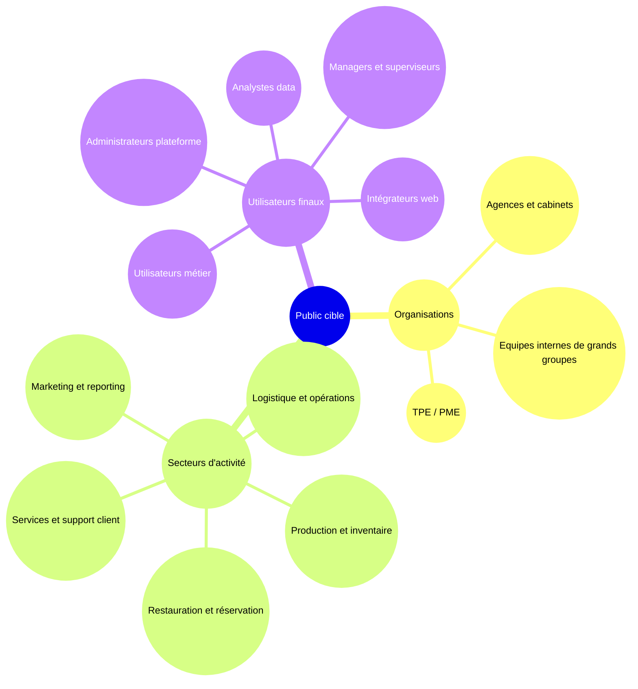

> [!info] Légende
> Cette carte regroupe la cible en trois niveaux : types d'organisations, secteurs d'activité et profils qui utiliseront ou administreront Prismatica.

#### Scénarios d'utilisation

Les scénarios se résument à une tendance d'usage : Prismatica part d'une donnée métier, la transforme en interface exploitable, puis la partage sous contrôle selon le profil utilisateur.

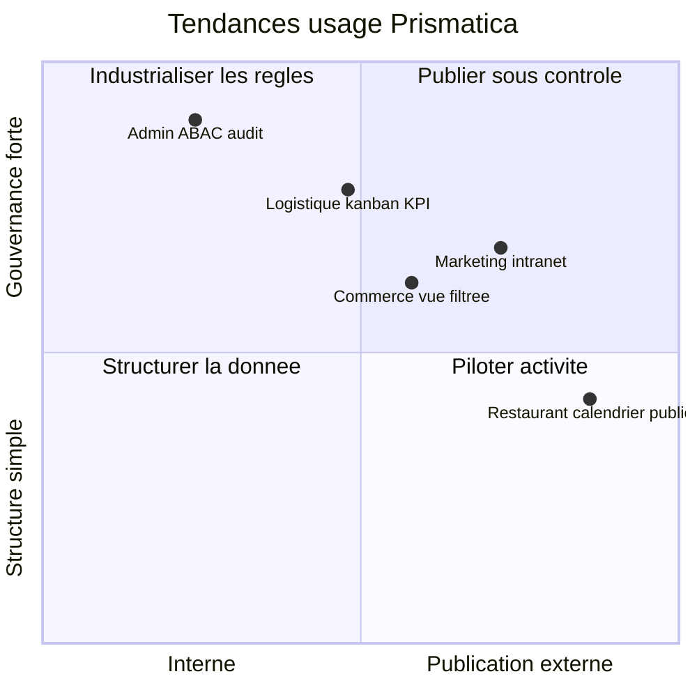

> [!info] Légende
> L'axe horizontal va de l'usage interne vers la publication externe. L'axe vertical va d'une simple structuration de données vers une gouvernance forte.

Ainsi, les cas marketing, restauration, logistique, commerce ou administration utilisent les mêmes briques : projet, collection, vue, dashboard, partage sécurisé et gouvernance.

### Fonctionnalités attendues

Le périmètre fonctionnel est volontairement présenté par rôle afin de distinguer création, administration et accès public.

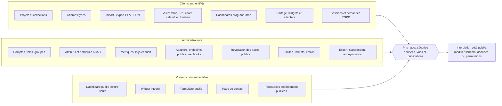

> [!info] Légende
> Le schéma distingue les capacités par rôle. Les clients créent et publient, les administrateurs gouvernent, et les visiteurs publics restent strictement en lecture ou saisie contrôlée.

#### MVP

Le MVP se concentre sur les fonctionnalités qui démontrent la valeur principale de Prismatica : transformer rapidement une donnée en interface exploitable.

Périmètre MVP :

- authentification et gestion de session ;
- création d'un projet ;
- création de collections et de champs ;
- import simple de données ;
- vue tableau filtrable et éditable ;
- au moins deux vues de visualisation : graphique et KPI ;
- création d'un dashboard ;
- partage en lecture seule ;
- permissions de base complétées par une structure compatible ABAC ;
- traçabilité des actions sensibles ;
- documentation d'installation Docker et pnpm.

#### perspective d'évolution

Les évolutions prévues concernent l'industrialisation de la plateforme et l'enrichissement de l'expérience utilisateur :

- éditeur de schéma visuel avec diagramme relationnel ;
- vues avancées : calendrier, kanban, carte, graphiques multi-séries ;
- génération d'endpoints REST contrôlés ;
- webhooks et imports planifiés ;
- bibliothèque de templates métiers ;
- système complet d'embed avec thème, langue et restrictions de domaines ;
- analytics avancées via plan de données dédié ;
- collaboration temps réel ;
- versioning des schémas et rollback ;
- marketplace d'adapters ;
- assistant de configuration pour guider les utilisateurs non techniques.

### Contraintes et risques

Le projet présente plusieurs contraintes liées à son ambition fonctionnelle et technique.

| Contrainte / risque                            | Impact possible                                        | Réponse prévue                                                      |
| ---------------------------------------------- | ------------------------------------------------------ | ------------------------------------------------------------------- |
| Largeur fonctionnelle du produit               | Risque de dispersion et de MVP trop vaste              | Priorisation autour du triptyque collections, vues, dashboards      |
| Données dynamiques créées par les utilisateurs | Complexité de modélisation et de validation            | Schéma contrôlé, types limités, migrations encadrées                |
| Permissions personnalisables                   | Risque de faille d'accès si la logique est côté client | Permissions serveur, ABAC, audit et tests d'accès                   |
| Dashboards publics et embeds                   | Risque d'exposition involontaire de données            | Lecture seule, tokens opaques, révocation, restrictions de domaines |
| Volumétrie des données                         | Risque de lenteur sur les vues et graphiques           | Pagination, agrégations serveur, cache et limites par plan          |
| Multiplication des services Docker             | Complexité de maintenance                              | Profils Compose par criticité et documentation d'exploitation       |
| Hétérogénéité SQL/NoSQL                        | Risque d'abstraction trop générale                     | Adapters spécialisés et vocabulaire API normalisé côté produit      |
| Conformité RGPD                                | Risque juridique et fonctionnel                        | Export, suppression, traçabilité et minimisation des données        |

La principale limite du projet concerne le temps disponible. Prismatica couvre un périmètre vaste : base de données visuelle, interface de type CMS métier, dashboards, adapters, embeds, permissions et infrastructure BaaS. Le MVP doit donc rester concentré sur les fonctionnalités qui prouvent la valeur du produit sans chercher à finaliser toutes les évolutions avancées.

### les livrables

Les livrables attendus pour le projet sont les suivants :

- dépôt GitHub contenant le code source, l'infrastructure et la documentation ;
- documentation d'installation et de lancement avec Docker Compose ;
- dossier projet décrivant le contexte, le besoin, la cible, l'architecture et les choix techniques ;
- documentation back-end de la plateforme mini-BaaS ;
- scripts de validation et de smoke tests ;
- configuration des services principaux : gateway, base de données, authentification, API, observabilité ;
- maquettes ou captures des interfaces principales ;
- jeu de données de test ou scripts de seed ;
- description des profils utilisateurs et des scénarios d'utilisation ;
- éléments de sécurité : authentification, permissions, séparation des accès, gestion des secrets ;
- procédure de déploiement ou d'exécution locale reproductible.

Ces livrables doivent permettre à un évaluateur, un développeur ou un membre d'équipe de comprendre le produit, de lancer l'environnement, de vérifier les choix techniques et d'identifier clairement les fonctionnalités réalisées ou prévues.

### Environnement humain et technique

#### Environnements humain et méthodologie

j'ai travaillé au sein d'une équipe de développement fonctionnant sous la méthodologie **Agile (Scrumban)**. Ce cadre a permis des cycles de développement itératifs et une collaboration étroite entre les membres de l'équipe, favorisant ainsi une adaptation rapide aux changements et une livraison continue de valeur. Nous avons utilisé des outils de gestion de projet tels que **Jira** pour suivre les tâches, les sprints et les progrès du projet, assurant une transparence totale et une communication efficace au sein de l'équipe.

les différents rôles au sein de l'équipe comprenaient un Product Owner, un Tech Lead, des développeurs front-end et back-end, ainsi que des spécialistes en sécurité. Chaque membre de l'équipe avait des responsabilités spécifiques, contribuant à la réussite globale du projet.

| Membre   | Rôle                                                    | spécialité             | Responsabilités observées / déduites                                                                                                                                    |
| :------- | ------------------------------------------------------- | ---------------------- | ----------------------------------------------------------------------------------------------------------------------------------------------------------------------- |
| dlesieur | Product Owner / Tech Lead / Product manager / developer | project chef           | Conception de l'architecture, intégration Docker, orchestration des services, sécurité, écriture des services NestJS, outillage d'exploitation, documentation technique |
| daniel   | Product Owner / Developeur                              | assistant project chef | Conception et développement des interfaces utilisateur, intégration avec le back-end, optimisation de l'expérience utilisateur                                          |
| sergio   | Tech Lead / Développeur                                 | frontend               | Conception et développement de l'API, gestion de la base de données, implémentation de la logique métier, sécurité du back-end                                          |
| roxanne  | Tech Lead                                               | security               | Analyse des risques de sécurité, mise en place de mesures de protection, audits de sécurité, conformité RGPD                                                            |
| vadim    | Product Manager / Developer                             | scrum manager          | Analyse des risques de sécurité, mise en place de mesures de protection, audits de sécurité, conformité RGPD                                                            |

J'étais donc au centre du processus, responsable de la chaîne complète de développement, de la donnée(BDD) à l'interface (front-end). L'organization de mon équipe tourné autour des principes de scrum, avec des réunions quotidiennes pour synchroniser les progrès, des revues de sprint pour évaluer les livrables et des rétrospectives pour identifier les axes d'amélioration. Cette approche a permis une collaboration efficace et une adaptation rapide aux changements de priorités ou de besoins du projet.

##### Rituels

Scrumban combine les éléments de Scrum et de Kanban pour offrir une flexibilité maximale dans la gestion des projets. Nous avons d'une part
scrum avec lequel des rituels mis en place pour assurer une collaboration efficace et une livraison continue de valeur:

- **Daily Stand-up**: une réunion quotidienne de 15 minutes pour synchroniser les progrès, identifier les obstacles et planifier les tâches pour la journée.
- **Sprint Planning**: une réunion au début de chaque sprint pour planifier les tâches à
- **DoD** (Definition of Done): une liste de critères que chaque tâche doit remplir pour être considérée comme terminée, assurant ainsi la qualité et la cohérence des livrables.
- **Sprint Review**: une réunion à la fin de chaque sprint pour présenter les livrables aux parties prenantes, recueillir des feedbacks et ajuster les priorités pour les prochains sprints.
- **Sprint Retrospective**: une réunion pour réfléchir sur le sprint écoulé, identifier ce qui a bien fonctionné, ce qui peut être amélioré et définir des actions concrètes pour améliorer les processus de travail.

mais aussi kanban avec lequel nous avons mis en place un tableau de tâches visuel pour suivre l'avancement du projet, avec des colonnes représentant les différentes étapes du processus de développement (To Do, In Progress, Done). Cela a permis une gestion flexible des tâches et une adaptation rapide aux changements de priorités.

> Contraintes:
> comme le projet avait une portée relativement large, il était essentiel de maintenir une communication claire et efficace au sein de l'équipe pour éviter les > malentendus et assurer une coordination fluide. De plus, la gestion du temps était un défi constant, nécessitant une planification rigoureuse et une capacité à s'adapter rapidement aux changements de priorités ou de besoins du projet. À cet effet, nous avons mis en place une fois par semaine une réunion pour travailler l'écoute active et autre modalité de communication pour améliorer la collaboration au sein de l'équipe.
> :warning: utiliser kanban pour l'intégralité du projet était une option trop lourde due à la largeur et la complexité du projet, et parce que nous étions habitué de faire des projets en solitaires beaucoup plus petits, nous avons opté pour utiliser le kanban seulement quand le container à créer demandé un très haut niveau de rigueur et de suivi, comme c'était le cas pour la partie développement du front-end avec `osionos` un container qui créer littéralement l'interface applicative de la solution. [pour en savoir plus](#ref-osionos)

##### Post de développement

- système d'exploitation: j'ai opéré sur un environnement Linux (Ubuntu) pour le développement, offrant une compatibilité optimale avec les outils et technologies utilisés dans le projet.
- IDE: Mon environnement de développement principal était **Visual Studio Code**, complété par des extensions pour l'investigation de code, la gestion de Git et le développement en React et Node.js.
- Environnement: les dépendances applicatives sont gérées avec pnpm dans Docker afin d'éviter les écarts entre postes de développement; la dépendance locale attendue est Docker.

##### pile applicative (conforme aux choix architecturaux)

- Front-end: Développé avec la librairie `React`. La stylisation a été assurée par `SCSS` (Sass) pour une meilleur modularité des feuillees de style et pour faciliter le _responsive design_
- Back-end: Construit avec `Node.js` et le framework `vite` pour une configuration rapide et une expérience de développement optimisée. J'ai utilisé `Express` pour la gestion des routes et des middlewares, et `MongoDB` et `PostgreSQL` pour la gestion des données, en fonction des besoins spécifiques de chaque fonctionnalité.
- base de données: j'ai utilisé `MongoDB` pour stocker les utilisateurs, les clients et les interventions. Les interactions se font via l'ORM `mongoose` qui garantit une gestion efficace des données et une intégration fluide avec le back-end.

##### gestion du code et contrôle de qualité

La qualité du code a été organisée comme une responsabilité partagée entre les Tech Leads et les développeurs. L'objectif était d'éviter d'avancer trop loin avec du code fragile, difficile à relire ou non sécurisé, car cela aurait créé de la dette technique sur un projet déjà large.

Le dépôt GitHub a servi de point central pour tracer les modifications. Nous avons suivi une logique proche de **Gitflow** : `main` pour le code stable, `develop` pour l'intégration, des branches `feat/`, `bugfix/`, `hotfix/` ou `migrate/` pour les travaux ciblés, puis des branches de release lorsque le code devait être stabilisé.

Les Tech Leads ont mis en place des garde-fous avant intégration : conventions de commits, hooks de pré-commit, linting, formatage, revues techniques et vérifications de sécurité. Cette organisation permettait de détecter tôt les erreurs de structure, les incohérences de style, les dépendances problématiques ou les régressions fonctionnelles.

> [!tip] À retenir
> L'objectif de cette chaîne qualité n'est pas de ralentir le développement, mais d'empêcher l'accumulation de dette technique et d'intégrer la sécurité dès la conception.

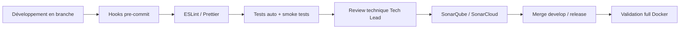

> [!info] Légende
> Chaque étape agit comme un filtre : le code passe par les hooks, le lint, les tests, la revue Tech Lead, l'analyse Sonar et la validation Docker avant stabilisation.

Les contrôles utilisés combinent plusieurs niveaux :

- **qualité de code** : `ESLint`, `Prettier`, conventions de nommage et règles de structure ;
- **historique Git** : commits explicites, branches dédiées et revue avant intégration ;
- **tests automatisés** : tests unitaires, scripts de validation et smoke tests des services ;
- **tests manuels** : scénarios de recette sur les fonctions critiques comme l'authentification, les permissions, les exports ou les mises à jour sensibles ;
- **analyse continue** : SonarQube / SonarCloud pour repérer dette technique, mauvaises pratiques et vulnérabilités potentielles ;
- **sécurité par design** : validation serveur, secrets hors du code, droits minimaux, audit et séparation des environnements.

Cette chaîne de contrôle n'avait pas pour but de ralentir l'équipe, mais de maintenir un niveau de qualité constant. Elle permettait aux Tech Leads de corriger les dérives tôt, avant qu'elles ne deviennent coûteuses à reprendre.

##### Environnements

Le projet a été pensé pour fonctionner dans un environnement **full Docker**. Chaque application ou service possède son conteneur, ses variables d'environnement, ses healthchecks et ses dépendances isolées. Cette approche facilite l'arrivée d'un collègue sur le projet : il n'a pas besoin d'installer manuellement toutes les versions de Node.js, pnpm, PostgreSQL, MongoDB ou Redis. La dépendance locale principale reste Docker.

| Environnement       | Usage principal                                   | Contrôles associés                                                   |
| ------------------- | ------------------------------------------------- | -------------------------------------------------------------------- |
| Développement local | Coder, déboguer et lancer les services rapidement | Docker Compose, hot reload, logs, lint, tests ciblés                 |
| Test / recette      | Valider les fonctionnalités avant stabilisation   | Données anonymisées, smoke tests, recette manuelle, revue de sprint  |
| Production cible    | Préparer un déploiement stable et surveillable    | Secrets séparés, healthchecks, limites, logs, métriques, sauvegardes |

La conteneurisation réduit les problèmes de dépendances entre postes et rend les validations plus fiables. Le même service peut être lancé, testé et supervisé de manière reproductible par plusieurs membres de l'équipe.

##### Sécurité et dette technique

La sécurité a été intégrée dès la conception plutôt qu'ajoutée en fin de projet. Les Tech Leads ont porté une attention particulière aux secrets, aux accès et aux validations côté serveur.

Les mesures principales sont :

- secrets séparés du code et injectés par variables d'environnement ou Vault ;
- hachage des mots de passe avec `bcrypt` et gestion des sessions par `JWT` ;
- contrôle d'accès par rôles, permissions et politiques serveur ;
- traçabilité des actions sensibles : connexions, modifications, exports ou suppressions ;
- vérification des dépendances et mauvaises pratiques via les outils d'analyse ;
- conformité progressive aux exigences RGAA : sémantique, contrastes et navigation clavier.

Cette démarche permet de limiter la dette technique. Chaque ajout fonctionnel doit rester lisible, testable, conteneurisé et compatible avec les règles de sécurité du projet.

##### Outillage et données de test

L'outillage de test a complété les contrôles de qualité. Les jeux de données ont été anonymisés lorsque nécessaire, les scripts SQL ont permis d'initialiser rapidement les environnements, et les formats CSV/JSON ont facilité les imports, exports et vérifications.

- jeux d'essai cohérents pour tester les parcours principaux ;
- scripts de seed ou d'initialisation pour reproduire un état de test ;
- smoke tests pour vérifier rapidement que les services essentiels répondent ;
- tests de recette manuels sur les parcours critiques front-end et back-end ;
- pagination, index SQL et limites d'API pour garder des temps de réponse acceptables.

### Objectifs de qualité

Les objectifs de qualité reposent sur une chaîne courte : produire un code lisible, le vérifier tôt, le tester dans Docker, le relire techniquement, puis seulement ensuite le stabiliser pour la recette ou la production.

## CHAPITRE 3. Les réalisations personnelles, front-end (React / SCSS)

## Maquette de l'application et schémas

### Conception "desktop first with mobile companion" et wireframes

### Charte graphique

### typographie

### schéa d'enchainement des maquettes

### Captures d'écran des interfaces utilisateur

### Extraits de code, interfaces utilisateur statiques (React / SCSS)

#### Organisation minimal du projet front

#### Extrait de code, page de connexion (statique et accessible)

### Extrait de code, partie dynamique(React/typecript)

#### Authentification: le formulaire de connexion dynamique

#### récupération des données: la liste des interventions

#### action métier critique: mise à jour du statut d'intervention

## CHAPITRE 4. Les réalisations personnelles, back-end (Node.js / Express / MongoDB / POSTGRESQL)

### Architecture de l'API et modèle de données

#### a. Comprendre le rôle du BaaS dans Prismatica

Le back-end de Prismatica n'a pas été conçu comme une simple API métier contenant quelques routes spécifiques. Il a été pensé comme une plateforme **BaaS**, c'est-à-dire un **Backend as a Service** auto-hébergé. Le principe est de fournir à l'application des briques back-end déjà prêtes : authentification, gateway, base relationnelle, base documentaire, moteur SQL fédéré, permissions, stockage de fichiers, temps réel, logs, métriques, services d'arrière-plan, administration de schéma et observabilité.

Cette approche correspond bien au besoin de Prismatica. L'application doit permettre à des équipes métier de créer des collections, des vues, des dashboards et des interfaces sans redévelopper un serveur à chaque nouveau cas d'usage. Le BaaS sert donc de socle technique commun : il reçoit les demandes du front-end, vérifie l'identité et les droits, choisit le bon service interne, interroge la bonne base de données et renvoie une réponse normalisée.

Dans cette architecture, le client ne pilote jamais directement la sécurité ni la base de données. Le navigateur, l'interface React ou le SDK JavaScript expriment une intention : lire une collection, créer une ressource, publier un dashboard, générer une URL de fichier ou lancer une requête. Le back-end reste l'autorité : il valide les entrées, applique les permissions et exécute l'action dans le service approprié.

> [!warning] Point de vigilance
> Le navigateur n'accède jamais directement à PostgreSQL, MongoDB, Trino ou MinIO. Toute action passe par le SDK, la gateway et les services privés.

Le point important est la séparation en couches. Les schémas de référence du projet représentent cette idée : une couche d'entrée HTTP, une couche d'orchestration, puis plusieurs plans de données isolés. `Kong` n'est pas un moteur de base de données. Il ne connaît ni les tables, ni les collections, ni les catalogues Trino. Son rôle est de recevoir les requêtes HTTP, choisir la route, appliquer les contrôles transverses et transmettre la requête au bon service privé.

`Trino`, lui, intervient plus bas dans l'architecture. C'est un moteur SQL fédéré : il reçoit du SQL ANSI depuis un service interne, puis utilise ses connecteurs pour interroger plusieurs sources comme PostgreSQL ou MongoDB. Il sert aux vues analytiques, aux dashboards et aux requêtes multi-sources. Il ne remplace pas PostgREST pour le CRUD transactionnel et il ne doit pas être exposé directement à Internet.

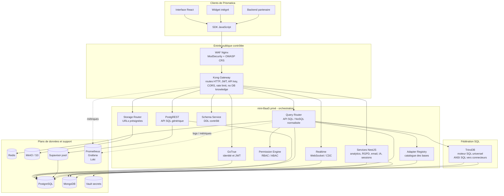

> [!info] Légende
> Les requêtes entrent par le WAF et Kong, passent dans l'orchestration mini-BaaS, puis atteignent les plans de données. Trino reste dans la couche fédérée et n'est jamais exposé directement.

Le diagramme montre que le BaaS agit comme une couche d'abstraction. Le front-end ne connaît pas l'emplacement réel des bases ni les détails des services internes. Il communique avec une API publique stable, puis la plateforme se charge de l'orchestration.

Le chemin `Kong` vers `Trino` se fait donc indirectement. Une requête de dashboard arrive sur une route publique, par exemple une route d'analytics ou de requête fédérée. `Kong` vérifie la clé API, le JWT, le quota et le format HTTP, puis transmet au service interne. Le service interne vérifie les droits métier avec `permission-engine`, récupère dans `adapter-registry` les bases autorisées pour le tenant, construit une requête SQL sûre, puis l'envoie à `Trino`. `Trino` exécute la requête via ses connecteurs PostgreSQL, MongoDB ou autres sources, et le service renvoie une réponse normalisée au SDK.

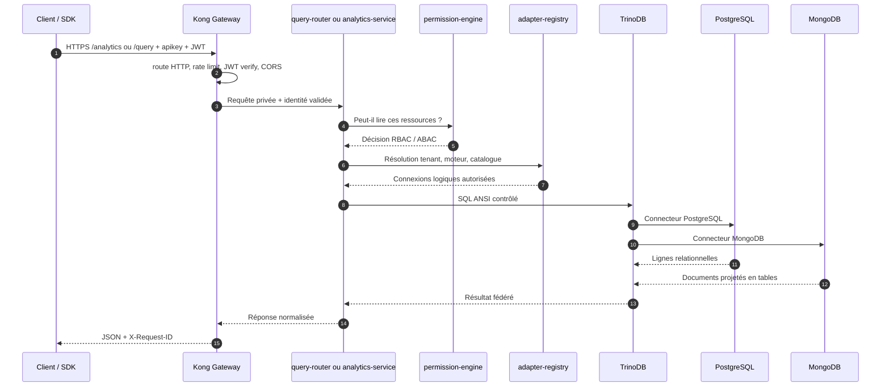

> [!info] Légende
> Ce scénario montre que Kong ne parle pas directement à Trino. Il transmet la requête à un service privé, qui vérifie les droits, résout les sources autorisées, puis interroge Trino.

Pour expliquer l'isolation des données, j'utilise trois modèles complémentaires :

| Modèle | Principe                                                                          | Utilisation dans Prismatica                                                                                                  |
| ------ | --------------------------------------------------------------------------------- | ---------------------------------------------------------------------------------------------------------------------------- |
| Silo   | Une base, un schéma ou une collection est séparée par tenant ou par projet        | Isolation forte pour les clients sensibles et limitation des effets de bord                                                  |
| Bridge | Une couche commune relie plusieurs moteurs avec une API unifiée                   | `query-router`, `adapter-registry` et `permission-engine` traduisent une intention produit vers PostgreSQL, MongoDB ou Trino |
| Pool   | Plusieurs tenants partagent une infrastructure, avec séparation logique et quotas | `Kong` mutualise l'entrée HTTP, `Supavisor` mutualise les connexions PostgreSQL, `Redis` mutualise des caches à TTL court    |

Le **silo** protège les données en les séparant physiquement ou logiquement. Le **bridge** évite que le front-end connaisse la technologie réelle utilisée derrière chaque ressource. Le **pool** améliore la performance et le coût d'exploitation, mais il impose des garde-fous : quotas, rate limiting, TTL, préfixes de clés, rôles et politiques d'accès.

Dans l'idéal produit, Prismatica doit donc consommer mini-BaaS comme un produit externe et stable. L'application web ne devrait pas importer la logique interne des microservices ni connaître les conteneurs. Elle devrait utiliser principalement le SDK JavaScript, configuré avec l'URL publique de la plateforme et la clé publique prévue pour le client. Côté exploitation, le BaaS peut être livré sous forme d'images Docker et démarré avec Docker Compose ou un déploiement équivalent. Prismatica devient alors une application cliente de la plateforme, et non une application couplée au code interne du BaaS.

Cette idée est cohérente, mais seulement si elle est formulée correctement. Le navigateur ne doit pas appeler directement PostgreSQL, MongoDB, Trino ou MinIO. La centralisation doit concerner l'**accès** aux données, pas forcément le stockage physique de toutes les données dans une seule base. Les bases restent spécialisées : PostgreSQL pour le relationnel et les permissions, MongoDB pour les documents et la configuration flexible, MinIO pour les fichiers, Trino pour les lectures fédérées analytiques. Le point central est le couple `SDK` + `Kong` + services privés, qui donne à la page web une seule API produit.

> [!tip] À retenir
> Prismatica doit centraliser l'accès aux données, pas forcer toutes les données dans une seule base. Chaque moteur garde son rôle, mais le front-end consomme une API unifiée.

Pour l'application de dashboarding, MongoDB est un bon choix pour stocker la configuration dynamique : définition des dashboards, widgets, filtres, préférences d'affichage, sources déclarées, layouts et paramètres utilisateur. Ces objets sont très variables et correspondent bien à un modèle documentaire. En revanche, MongoDB ne doit pas être présenté comme l'unique source de toutes les données métier. Les widgets peuvent lire des données venant de PostgreSQL, MongoDB ou d'autres sources, mais ces lectures doivent passer par le query-router, les permissions, éventuellement Trino pour les requêtes fédérées, puis revenir sous forme de réponse normalisée.

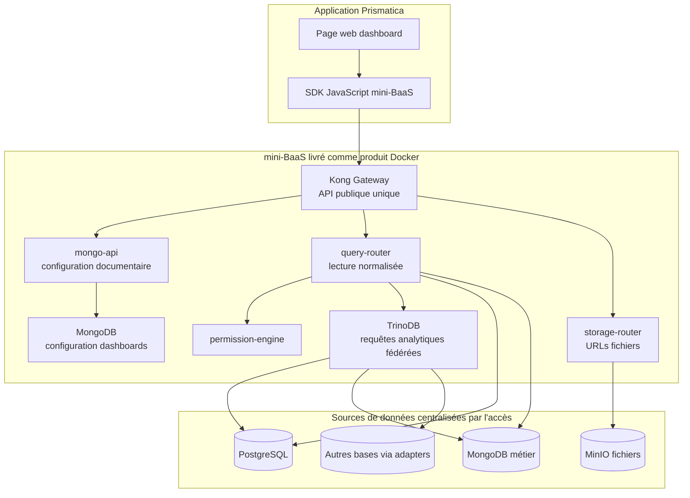

> [!info] Légende
> La configuration des dashboards peut vivre dans MongoDB, tandis que les données affichées peuvent venir de PostgreSQL, MongoDB, MinIO ou d'autres bases via les adapters.

Ce modèle permet de construire une page web qui agrège plusieurs bases de données sans exposer ces bases au client. La page demande un dashboard, le SDK appelle l'API publique, le BaaS charge la configuration dans MongoDB, vérifie les droits, interroge les sources nécessaires et renvoie des données prêtes à afficher. La faisabilité dépend donc de trois conditions : des connecteurs déclarés dans l'adapter-registry, des règles de permissions fiables, et une distinction claire entre configuration de dashboard, données transactionnelles et requêtes analytiques.

#### b. Architecture générale de l'API

L'architecture est organisée en plusieurs plans. Cette séparation évite de traiter tous les conteneurs comme s'ils étaient aussi critiques. Le cœur BaaS contient le chemin de requête indispensable : WAF, Kong, PostgreSQL, GoTrue, PostgREST, Realtime et Redis. Les services plus spécialisés sont activés selon les besoins avec des profils Docker Compose.

| Plan            | Rôle                                                 | Services principaux                                                          | Criticité                               |
| --------------- | ---------------------------------------------------- | ---------------------------------------------------------------------------- | --------------------------------------- |
| Entrée publique | Filtrer et router les requêtes venant de l'extérieur | WAF, Kong Gateway                                                            | Très élevée                             |
| Cœur BaaS       | Authentification, REST SQL, temps réel et cache      | GoTrue, PostgREST, PostgreSQL, Realtime, Redis                               | Très élevée                             |
| Adapter plane   | API de données normalisée SQL / NoSQL                | query-router, adapter-registry, permission-engine                            | Élevée si l'API multi-base est utilisée |
| Control plane   | Administration, secrets, schémas et métadonnées      | Vault, schema-service, pg-meta, Studio, Supavisor                            | Moyenne, surtout admin                  |
| Data plane      | Stockages secondaires et fichiers                    | MongoDB, MinIO, storage-router                                               | Variable selon les fonctionnalités      |
| Analytics       | Requêtes analytiques et fédération                   | Trino, analytics-service                                                     | Non critique pour le CRUD               |
| Background      | Traitements asynchrones                              | email-service, newsletter-service, gdpr-service, ai-service, session-service | Non bloquant                            |
| Observabilité   | Surveillance, logs et métriques                      | Prometheus, Grafana, Loki, Promtail, log-service                             | Forte en production                     |

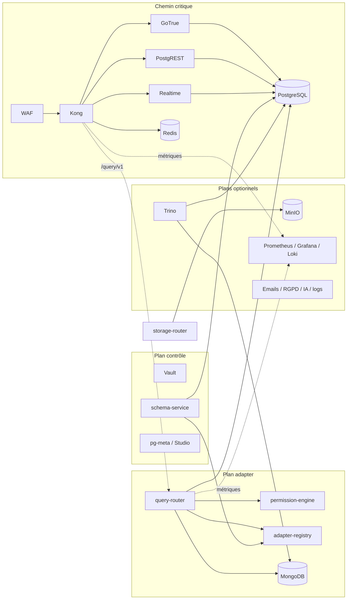

> [!info] Légende
> Le chemin critique garde l'authentification et le CRUD disponibles. Les plans adapter, contrôle, analytics, stockage et observabilité peuvent être activés selon les besoins.

Le choix important est que le CRUD relationnel de base peut rester disponible même si les services optionnels sont arrêtés. Par exemple, une panne du service analytics ou du service email ne doit pas empêcher la connexion d'un utilisateur ni la lecture d'une table via PostgREST.

#### c. Clients, SDK et passerelle API

Plusieurs types de clients peuvent utiliser Prismatica : l'interface React principale, un widget public intégré dans un site externe, un back-end partenaire ou un outil d'administration. Pour éviter que chaque client connaisse les routes internes, un SDK JavaScript sert de couche d'accès produit.

Le SDK expose des méthodes compréhensibles : se connecter, lire une collection, créer un document, générer une URL de stockage, envoyer un événement analytics ou récupérer l'état de la plateforme. En interne, le SDK ajoute les clés publiques, le JWT utilisateur, les timeouts, les retries et les erreurs normalisées.

La passerelle API `Kong` est le seul point d'entrée applicatif. Elle applique les contrôles transverses : CORS, API key, vérification JWT, rate limiting, limitation de taille des requêtes, corrélation par `X-Request-ID` et ajout d'en-têtes d'identité de confiance pour les services internes.

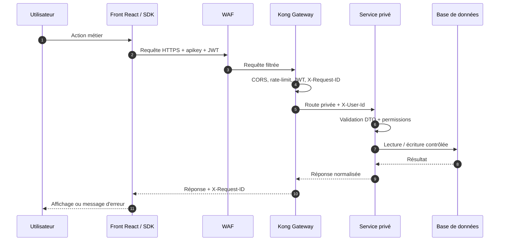

> [!info] Légende
> Le SDK exprime l'action métier, Kong applique les contrôles transverses, puis le service privé valide les DTOs et permissions avant d'accéder à la base.

Cette organisation simplifie le front-end. Le client n'a pas besoin de connaître l'adresse de MongoDB, de PostgreSQL, de MinIO ou des services NestJS. Il connaît seulement l'URL publique de la plateforme.

#### d. Maillage de services et communication interne

Le projet utilise un **maillage logique de services**. Il ne s'agit pas d'un service mesh Kubernetes complet comme Istio ou Linkerd, mais d'une organisation équivalente à l'échelle Docker Compose : chaque service est isolé dans son conteneur, possède un nom DNS privé, expose des endpoints de santé et communique avec les autres services par HTTP interne.

Les règles du maillage sont les suivantes :

- les services internes ne sont pas appelés directement depuis Internet ;
- la gateway est le point d'entrée unique ;
- les appels internes utilisent les noms de services Docker, par exemple `http://permission-engine:3050` ;
- les appels machine-to-machine sensibles utilisent un en-tête `X-Service-Token` ;
- chaque requête garde un `X-Request-ID` pour relier les logs ;
- les services exposent des endpoints de santé `health/live` et `health/ready` ;
- les erreurs sont normalisées pour faciliter le diagnostic.

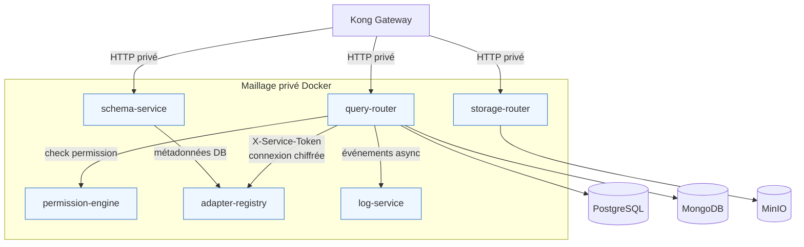

> [!info] Légende
> Le maillage est privé : Kong appelle les services internes, et les services spécialisés communiquent entre eux avec des tokens, des noms DNS Docker et un `X-Request-ID` commun.

Ce maillage apporte une meilleure séparation des responsabilités. Le service de permissions ne gère pas les connexions aux bases. Le registre d'adapters ne décide pas si une requête est autorisée. Le query-router orchestre, mais délègue les décisions spécialisées aux services dédiés.

#### e. Services autonomes et conteneurisation

Chaque service applicatif personnalisé est développé en Node.js avec TypeScript et NestJS. Le nom du chapitre mentionne Express, car Express reste l'écosystème HTTP classique de Node.js ; dans le projet, NestJS fournit une architecture plus structurée au-dessus du runtime Node : modules, contrôleurs, services, injection de dépendances, DTOs et guards.

Les services sont construits avec un Dockerfile commun. Le même Dockerfile peut compiler plusieurs applications en utilisant un argument de build. Cela évite de maintenir un Dockerfile différent pour chaque microservice.

La plateforme ne se limite pas aux services NestJS. Elle combine des briques d'infrastructure, des bases de données, des services Supabase compatibles et des services applicatifs développés pour Prismatica.

| Service / composant                    | Rôle dans le BaaS                                                                         | Pourquoi il est important                                                          |
| -------------------------------------- | ----------------------------------------------------------------------------------------- | ---------------------------------------------------------------------------------- |
| WAF Nginx / ModSecurity                | Filtrer les requêtes publiques avant l'API gateway                                        | Bloque une partie des attaques HTTP courantes avant qu'elles touchent les services |
| Kong Gateway                           | Router les routes HTTP, vérifier JWT / API key, appliquer CORS, rate limit et corrélation | Point d'entrée unique, sans connaissance directe des bases de données              |
| GoTrue                                 | Gérer inscription, connexion, JWT, refresh tokens et identité utilisateur                 | Fournit l'identité utilisée par Kong, PostgREST et les services privés             |
| PostgreSQL                             | Stockage relationnel principal                                                            | Auth, données structurées, permissions, schémas et métadonnées                     |
| PostgREST                              | Exposer automatiquement une API REST sur PostgreSQL                                       | Chemin CRUD relationnel simple et performant                                       |
| Supavisor                              | Pool de connexions PostgreSQL                                                             | Évite de saturer PostgreSQL quand plusieurs services montent en charge             |
| Realtime                               | WebSocket et CDC                                                                          | Diffuse les changements et événements en temps réel vers le client                 |
| Redis                                  | Cache, TTL courts, coalescing et futures files d'attente                                  | Réduit la latence sans devenir une source de vérité métier                         |
| MongoDB                                | Stockage documentaire secondaire                                                          | Collections souples, analytics, documents et usages non relationnels               |
| MinIO                                  | Stockage objet compatible S3                                                              | Fichiers, exports et assets via URLs présignées                                    |
| TrinoDB                                | Moteur SQL fédéré                                                                         | Requêtes analytiques multi-sources sans exposer les bases directement              |
| Vault                                  | Gestion des secrets et rotation                                                           | Centralise les secrets sensibles utilisés par les services                         |
| pg-meta / Studio                       | Métadonnées PostgreSQL et administration                                                  | Inspection, administration et support des opérations de schéma                     |
| Prometheus / Grafana / Loki / Promtail | Métriques, dashboards et logs                                                             | Observabilité de bout en bout avec `X-Request-ID`                                  |

Les services NestJS ajoutent ensuite la logique de plateforme spécifique : orchestration multi-base, permissions avancées, génération de schémas, stockage, analytics, RGPD, email, logs, sessions et IA.

| Service           | Responsabilité principale                                                | Données / dépendances                      |
| ----------------- | ------------------------------------------------------------------------ | ------------------------------------------ |
| query-router      | Exécuter une intention de lecture ou mutation vers PostgreSQL ou MongoDB | adapter-registry, permission-engine, Redis |
| adapter-registry  | Enregistrer les bases des tenants et chiffrer les chaînes de connexion   | PostgreSQL, AES-256-GCM, clé Vault         |
| permission-engine | Vérifier les droits RBAC / ABAC côté serveur                             | PostgreSQL, fonction `has_permission()`    |
| schema-service    | Créer des tables ou collections depuis une spécification                 | PostgreSQL, MongoDB, adapter-registry      |
| mongo-api         | Fournir une API documentaire propriétaire                                | MongoDB                                    |
| storage-router    | Générer des URLs présignées pour fichiers                                | MinIO / S3                                 |
| analytics-service | Stocker et lire les événements analytiques                               | MongoDB                                    |
| email-service     | Envoyer des emails transactionnels                                       | SMTP                                       |
| gdpr-service      | Gérer consentement, export et suppression                                | PostgreSQL, webhooks                       |
| log-service       | Recevoir et exposer des logs applicatifs                                 | Mémoire / observabilité                    |
| session-service   | Gérer des sessions applicatives complémentaires                          | PostgreSQL                                 |
| ai-service        | Fournir un client LLM compatible OpenAI                                  | API LLM, MongoDB                           |

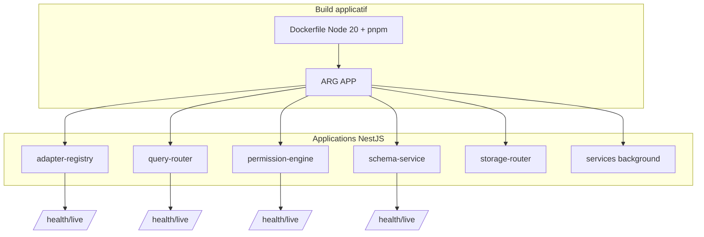

> [!info] Légende
> Un Dockerfile commun construit plusieurs services grâce à l'argument `APP`. Chaque service garde ensuite son endpoint de santé et son cycle de vie conteneurisé.

Grâce aux conteneurs, chaque service possède son cycle de vie : démarrage, healthcheck, redémarrage, limites CPU/mémoire et dépendances. Cela rend le système plus facile à isoler, tester et faire évoluer.

#### f. Contrats API, validation et sécurité applicative

Le back-end repose sur des contrats explicites. Les entrées sont décrites par des DTOs, validées avant traitement, puis transformées en objets typés. Les contrôleurs reçoivent les requêtes HTTP, les services appliquent la logique, et les guards imposent l'authentification ou les rôles.

Les contrats importants sont :

| Contrat               | Fonction                                            | Exemple dans le projet                                             |
| --------------------- | --------------------------------------------------- | ------------------------------------------------------------------ |
| DTO                   | Décrire et valider le corps des requêtes            | requête de query, création de schéma, génération d'URL de stockage |
| Guards                | Refuser les accès non authentifiés ou non autorisés | `AuthGuard`, `RolesGuard`, `ServiceTokenGuard`                     |
| En-têtes de confiance | Transmettre l'identité validée par la gateway       | `X-User-Id`, `X-User-Email`, `X-User-Role`                         |
| Corrélation           | Suivre une requête dans plusieurs services          | `X-Request-ID`                                                     |
| Health checks         | Vérifier l'état d'un conteneur                      | `health/live`, `health/ready`                                      |
| Réponses normalisées  | Garder un format prévisible côté client             | interceptors et filtres d'exception                                |

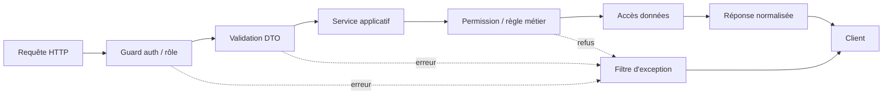

> [!info] Légende
> La requête traverse les guards, la validation DTO, la logique métier et les permissions avant l'accès aux données. Les erreurs sont normalisées avant retour client.

Cette structure limite les risques classiques : injection, requêtes mal formées, accès non authentifiés, contournement des droits ou erreurs non exploitables par le front-end.

#### g. Fournisseur d'identité et gestion des accès

L'identité est fournie par GoTrue. Ce service gère l'inscription, la connexion, les tokens JWT, les refresh tokens, le MFA et les fournisseurs OAuth possibles. Une fois connecté, l'utilisateur reçoit un JWT. Ce token est envoyé à la gateway à chaque requête protégée.

Kong vérifie le JWT et ajoute ensuite des en-têtes d'identité aux services internes. Les services n'ont donc pas à réinterpréter seuls le token à chaque appel. Ils lisent une identité déjà contrôlée par la gateway.

Pour les droits fins, le projet utilise un moteur de permissions séparé. Le `permission-engine` s'appuie sur des rôles, des policies et une fonction SQL de type ABAC. Cela permet d'exprimer des règles comme : un utilisateur peut lire une ressource uniquement si elle appartient à son tenant, à son équipe, ou si l'action demandée correspond à son rôle.

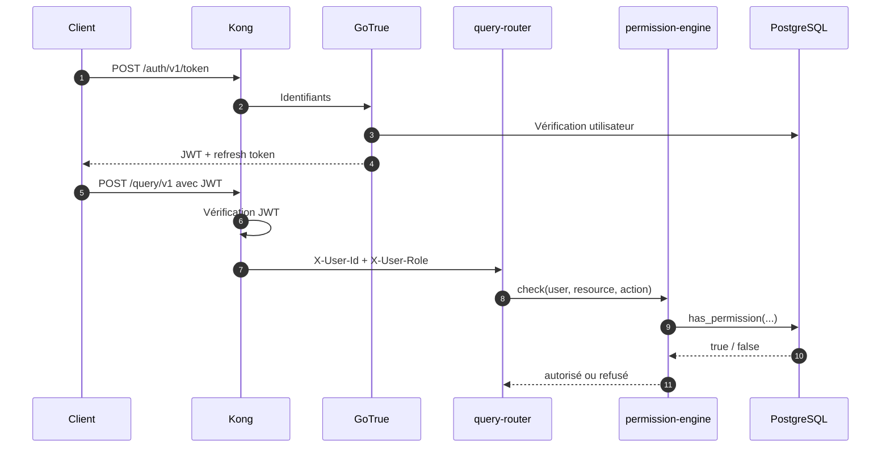

> [!info] Légende
> GoTrue fournit le JWT, Kong vérifie l'identité, puis le `permission-engine` applique la décision d'accès fine avant que la requête ne continue.

Le point essentiel est que l'interface peut masquer ou afficher certains boutons selon les droits connus, mais elle ne décide jamais définitivement. La décision réelle est toujours contrôlée côté serveur.

#### h. Bases de données, stockage et contenu statique

Le BaaS utilise plusieurs formes de stockage, chacune avec un rôle précis.

| Stockage   | Usage principal                                            | Pourquoi ce choix                                   |
| ---------- | ---------------------------------------------------------- | --------------------------------------------------- |
| PostgreSQL | Données relationnelles, auth, policies, registres, schémas | Fiabilité, SQL, transactions, RLS, contraintes      |
| MongoDB    | Données documentaires, analytics, collections flexibles    | Souplesse de modèle, documents JSON, change streams |
| Redis      | Cache, coalescing, futurs usages pub/sub ou queues         | Rapidité, TTL, partage entre instances              |
| MinIO      | Fichiers, imports, exports, médias, pièces jointes         | Compatible S3, auto-hébergeable                     |
| Trino      | Requêtes analytiques et fédérées                           | Analyse multi-sources sans impacter le CRUD         |

Le contenu statique est séparé de l'API. Les fichiers d'interface, les assets et les widgets publics peuvent être servis par un serveur web ou un CDN. Les fichiers métier, comme les exports CSV, images, documents ou pièces jointes, sont stockés dans MinIO. Le client n'accède pas directement aux credentials S3 : il demande au `storage-router` une URL présignée limitée dans le temps.

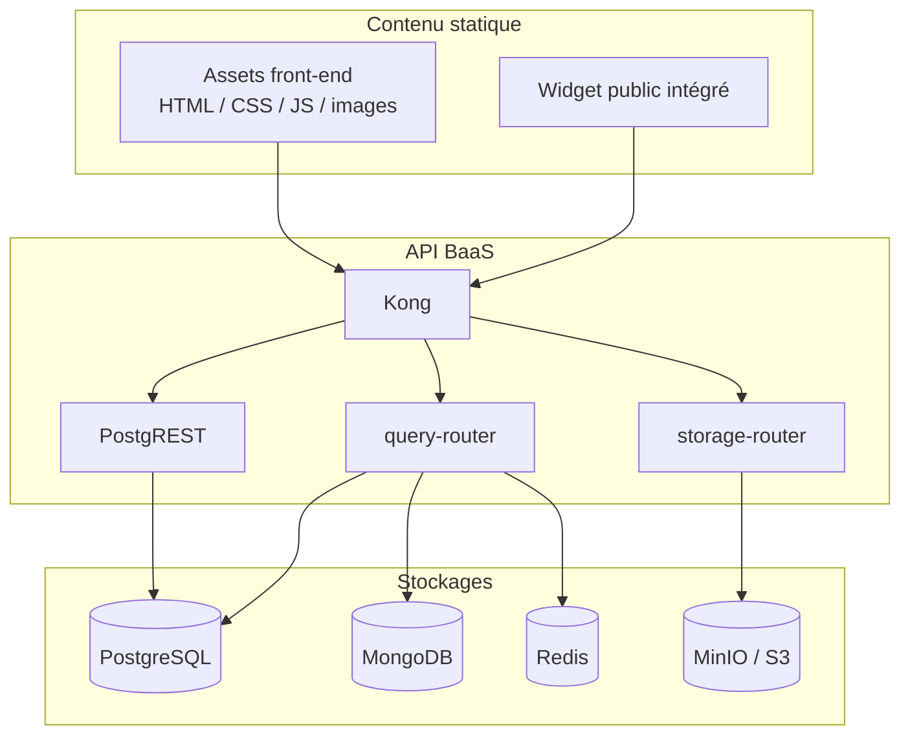

> [!info] Légende
> Les assets statiques, l'API et les fichiers métier sont séparés. MinIO n'est pas exposé directement : le client passe par `storage-router` pour obtenir une URL limitée.

Ce découpage évite de confondre les responsabilités : les assets statiques servent l'interface, l'API traite les données, et MinIO stocke les fichiers utilisateurs.

#### i. Fonctionnement du query-router

Le `query-router` est une partie centrale de l'API de données normalisée. Il permet d'envoyer une intention produit sans exposer directement les détails internes de PostgreSQL ou MongoDB. Par exemple, le SDK peut demander une action `read`, `create`, `update` ou `delete`. Le query-router transforme ensuite cette action en opération adaptée au moteur ciblé : `select` ou `insert` pour PostgreSQL, `find` ou `insertOne` pour MongoDB.

Le chemin est volontairement sécurisé :

1. le query-router récupère la connexion de la base dans l'`adapter-registry` ;
2. il vérifie les droits avec le `permission-engine` ;
3. il applique le cache de lecture si l'action est éligible ;
4. il exécute la requête dans le moteur PostgreSQL ou MongoDB ;
5. il invalide le cache en cas de mutation ;
6. il envoie des métriques et événements asynchrones.

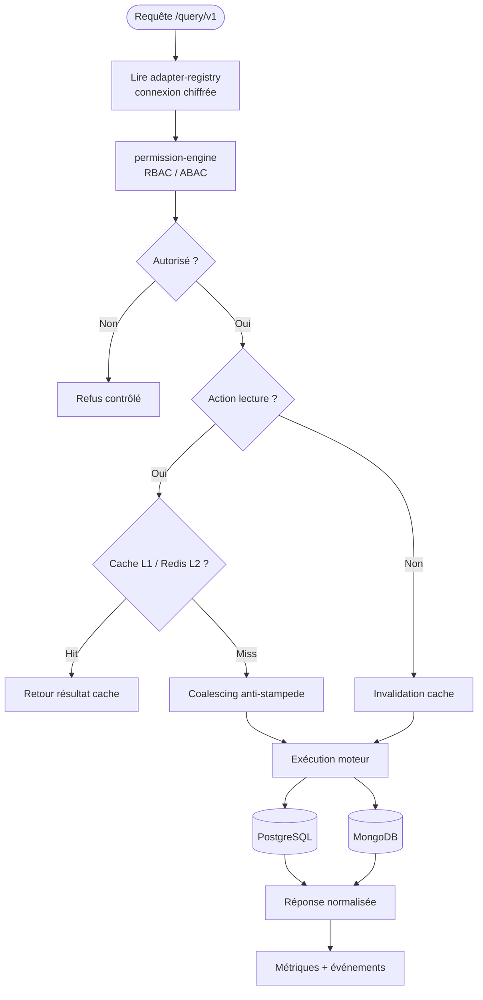

> [!info] Légende
> Le `query-router` transforme une intention produit en opération SQL ou NoSQL, après résolution de connexion, contrôle ABAC, cache et normalisation du résultat.

Cette couche évite que le front-end contienne des règles spécifiques à chaque base. Le produit garde un vocabulaire commun, tandis que le back-end conserve la logique d'exécution et de sécurité.

#### j. Modèle de données conceptuel

Le modèle de données combine un socle système et des données métier dynamiques. Le socle système stocke les utilisateurs, rôles, policies, bases enregistrées et schémas. Les données métier peuvent ensuite vivre dans PostgreSQL ou MongoDB selon le type de projet.

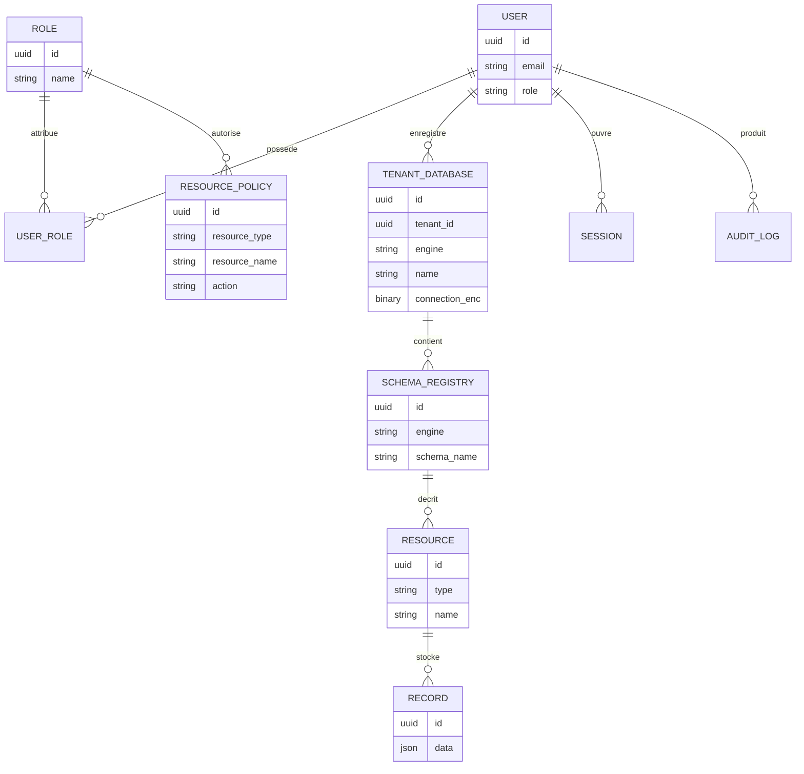

> [!info] Légende
> Le modèle est conceptuel : il montre les liens entre identité, rôles, policies, bases enregistrées, schémas et ressources, sans imposer une seule base physique.

Ce schéma est conceptuel. Il ne représente pas une seule table unique contenant tout le métier, mais la logique générale de la plateforme : identité, droits, registres, schémas et ressources manipulées par Prismatica.

### Extraits de code, structure et sécurité de l'API

#### Choix techniques (contexte et logique)

La structure back-end est organisée en services NestJS indépendants. Chaque service contient ses contrôleurs, ses DTOs, ses services métier et ses modules. Une librairie commune fournit les éléments transverses : guards d'authentification, validation, filtres d'erreurs, interceptors de réponse et corrélation des requêtes.

Le choix NestJS apporte une architecture plus robuste qu'un serveur Express minimal :

- les contrôleurs restent concentrés sur l'entrée HTTP ;
- les services contiennent la logique métier ;
- les DTOs rendent les contrats explicites ;
- l'injection de dépendances facilite les tests et la séparation des responsabilités ;
- les guards rendent la sécurité réutilisable ;
- les interceptors standardisent les réponses.

#### Extrait: contrôle d'ownership et règle d'habilitation critique

La règle d'habilitation la plus importante est la suivante : un utilisateur ne peut pas accéder à une ressource uniquement parce qu'il connaît son identifiant. Les services vérifient son identité, son tenant, ses rôles et les policies applicables.

L'`adapter-registry` illustre ce principe. Les bases enregistrées appartiennent à un tenant. Les chaînes de connexion sont chiffrées avec AES-256-GCM. Lorsqu'une connexion est demandée, le service effectue une requête tenant-aware et ne renvoie la connexion déchiffrée que si la base appartient bien à l'utilisateur ou au tenant autorisé.

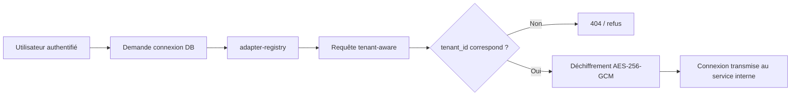

> [!info] Légende
> Même avec un identifiant connu, l'accès est refusé si le tenant ne correspond pas. La connexion chiffrée n'est transmise qu'après contrôle d'appartenance.

Cette règle empêche un utilisateur d'exploiter un identifiant deviné pour atteindre une base qui ne lui appartient pas. Même si la route est appelée correctement, l'accès reste filtré côté serveur.

#### Extrait 2: mise à jour contrôlée et validation métier

Pour une mutation, le query-router ne se contente pas d'exécuter une requête. Il convertit l'action produit en action technique, vérifie les permissions, invalide le cache concerné, exécute la mutation puis enregistre les métriques. Cela permet de conserver une logique cohérente entre PostgreSQL et MongoDB.

| Étape                  | Objectif                                                | Risque évité                       |
| ---------------------- | ------------------------------------------------------- | ---------------------------------- |
| Validation de l'action | Accepter seulement `read`, `create`, `update`, `delete` | Opération inconnue ou dangereuse   |
| Vérification ABAC      | Confirmer le droit côté serveur                         | Escalade de privilèges côté client |
| Invalidation cache     | Éviter de servir une ancienne valeur                    | Données périmées après mutation    |
| Exécution moteur       | Appliquer l'opération SQL ou NoSQL                      | Couplage direct du client à la DB  |
| Métriques / événement  | Observer le comportement                                | Débogage impossible en production  |

#### d. Préparation du déploiement

Le déploiement est préparé autour de Docker Compose, des profils de services et de scripts de validation. La dépendance locale principale est Docker. Les dépendances Node.js sont installées avec pnpm dans les conteneurs afin de limiter les écarts entre postes de développement.

Les contrôles de production retenus sont :

- gateway unique en entrée ;
- services internes privés ;
- variables d'environnement et secrets séparés du code ;
- healthchecks Docker ;
- limites mémoire et CPU sur les services critiques ;
- scripts de smoke test ;
- métriques Prometheus ;
- logs centralisés avec Loki / Promtail ;
- dashboards Grafana ;
- séparation des plans de criticité.

### Pourquoi cette architecture plutôt qu'un monolithe ?

Une architecture monolithique aurait été plus simple au démarrage : un seul serveur, une seule base, un seul déploiement. Cependant, Prismatica doit fournir une plateforme générique, extensible, multi-service et sécurisée. Le choix BaaS modulaire devient plus pertinent, car les fonctionnalités n'ont pas toutes la même criticité ni le même rythme d'évolution.

Le choix modulaire n'est donc pas seulement technique. Il répond au besoin produit : Prismatica doit être capable d'ajouter de nouveaux adapters, de nouveaux types de vues, des dashboards publics, des intégrations, des services de fond ou de l'analytics sans casser le cœur d'authentification et de données.

### Avantages, contraintes et limites de l'approche BaaS

| Critère                    | BaaS modulaire Prismatica                                                                                   | Back-end classique / normal                                                                 |
| -------------------------- | ----------------------------------------------------------------------------------------------------------- | ------------------------------------------------------------------------------------------- |
| Réutilisation              | 🟢 Le socle sert plusieurs produits : auth, gateway, stockage, permissions, logs et SDK restent communs.    | 🔴 Souvent couplé à une seule application métier, donc moins réutilisable.                  |
| Sécurité                   | 🟢 Les contrôles sont répartis : WAF, Kong, guards, permissions serveur, secrets et services privés.        | 🟠 Plus simple à comprendre, mais beaucoup de contrôles se retrouvent dans le même serveur. |
| Évolution                  | 🟢 Un service peut évoluer ou être remplacé sans casser tout le produit si les contrats restent stables.    | 🔴 Chaque évolution importante touche souvent le même bloc applicatif.                      |
| Performance                | 🟠 Latence interne possible, compensée par cache, coalescing, quotas et séparation du chemin critique.      | 🟢 Moins d'appels réseau internes, donc plus direct pour un petit périmètre.                |
| Exploitation               | 🔴 Plus de conteneurs à surveiller : documentation, healthchecks et profils Compose sont indispensables.    | 🟢 Déploiement plus simple au début : un serveur, une base, moins de dépendances.           |
| Observabilité              | 🟢 `X-Request-ID`, logs structurés, métriques Prometheus et dashboards rendent le diagnostic précis.        | 🟠 Diagnostic plus simple localement, mais moins adapté quand les usages se multiplient.    |
| Dette technique            | 🟢 Responsabilités séparées et contrats explicites limitent l'accumulation de logique dans un seul fichier. | 🔴 Le risque de grossir en monolithe difficile à maintenir augmente avec le périmètre.      |
| Pertinence pour Prismatica | 🟢 Adapté à une plateforme data extensible, multi-services, SDK-first et Dockerisée.                        | 🔴 Adapté à une application plus petite, mais trop limité pour le produit visé.             |

La contrainte principale est donc la complexité opérationnelle. Pour la maîtriser, le projet ne lance pas tout par défaut : le cœur BaaS reste compact, puis les plans adapter, data, analytics, storage, background et observability sont activés seulement lorsque le besoin existe.

### Synthèse du chapitre back-end

Le back-end réalisé pour Prismatica constitue un socle BaaS complet. Il fournit une gateway publique sécurisée, un fournisseur d'identité, des services autonomes, un maillage privé de communication, plusieurs bases de données, du stockage objet, un système de permissions serveur et une architecture conteneurisée reproductible.

Ce choix est plus ambitieux qu'une API monolithique classique, mais il répond mieux au projet : Prismatica n'est pas seulement une application métier figée, c'est une plateforme de gestion de données capable de créer des interfaces, dashboards, widgets et intégrations à partir d'un socle back-end générique et sécurisé.

## CHAPITRE 5. Eléments de sécurité de l'application

La sécurité a représenté un enjeu stratégique tout au long du développement de **Prismatica**. Les mesures décrites ci-dessous correspondent à ce qui est réellement présent dans le codespace : gateway `Kong`, authentification `GoTrue`, guards NestJS, validation stricte des DTOs, isolation par propriétaire, chiffrement des chaînes de connexion, limitation des routes sensibles et services RGPD.

> [!warning] Point de vigilance
> Certaines protections sont portées par des briques externes du BaaS. Par exemple, le hachage des mots de passe n'est pas réécrit dans un service NestJS : il est délégué au conteneur `GoTrue`, qui gère l'inscription, la connexion, les tokens et la politique de mot de passe.

### Authentification et gestion des rôles

L'accès à l'application repose sur une chaîne d'authentification en plusieurs niveaux. `GoTrue` émet les tokens JWT, `Kong` vérifie les clés API et les JWT sur les routes protégées, puis les services NestJS lisent les en-têtes d'identité de confiance injectés par la gateway.

Les éléments prouvés dans le code sont les suivants :

- `GoTrue` est configuré comme service d'authentification, avec un `JWT_SECRET`, une expiration de token, le MFA activé, la rotation des refresh tokens et une longueur minimale de mot de passe ;
- `Kong` déclare un consommateur JWT `authenticated` et vérifie les tokens avec l'algorithme `HS256` ;
- les routes applicatives exposées par `Kong` utilisent `key-auth`, `jwt`, du rate limiting et parfois une limitation de taille de requête ;
- les services NestJS ne se fient pas au corps de requête pour identifier l'utilisateur : ils utilisent `AuthGuard`, `CurrentUser()` et les en-têtes `X-User-Id`, `X-User-Email`, `X-User-Role`.

Extrait de configuration `GoTrue` dans `docker-compose.yml` :

```yaml
GOTRUE_JWT_SECRET: ${JWT_SECRET}
GOTRUE_JWT_EXP: 3600
GOTRUE_MFA_ENABLED: "true"
GOTRUE_SECURITY_REFRESH_TOKEN_ROTATION_ENABLED: "true"
GOTRUE_PASSWORD_MIN_LENGTH: 8
```

Extrait de configuration `Kong` pour les JWT :

```yaml
- username: authenticated
  jwt_secrets:
    - key: __GOTRUE_JWT_ISS__
      secret: __JWT_SECRET__
      algorithm: HS256
```

Les rôles réellement présents dans le socle ne sont pas des rôles métier comme technicien ou planificateur. Le code met en place des rôles de plateforme : `admin`, `user`, `guest`, `moderator` et `service_role`. Les rôles métier peuvent ensuite être modélisés au-dessus de ce socle.

> [!tip] À retenir
> L'authentification est centralisée par `GoTrue` et `Kong`, tandis que les services privés appliquent les décisions métier à partir d'une identité déjà contrôlée.

Le système d'habilitation est hybride : RBAC pour les rôles, ABAC pour les politiques de ressources. La migration SQL `007_permissions_system.sql` crée les tables `roles`, `user_roles`, `resource_policies` et la fonction `has_permission()`.

```sql
CREATE OR REPLACE FUNCTION public.has_permission(
  p_user_id UUID,
  p_resource_type TEXT,
  p_resource_name TEXT,
  p_action TEXT
) RETURNS BOOLEAN AS $fn$
```

Le service `permission-engine` appelle ensuite cette fonction pour décider si l'action demandée est autorisée :

```ts
const rows = await this.pg.adminQuery<{ has_permission: boolean }>(
  `SELECT public.has_permission($1::uuid, $2, $3, $4) AS has_permission`,
  [userId, resourceType, resourceName, action],
);

const allowed = rows[0]?.has_permission ?? false;
```

Le `query-router` applique une stratégie de refus par défaut : si le `permission-engine` ne répond pas correctement ou si le circuit breaker est ouvert, la requête est refusée plutôt qu'acceptée.

```ts
if (error instanceof CircuitBreakerOpenError) {
  throw new ForbiddenException(
    "Permission check temporarily unavailable; request denied by fail-closed policy",
  );
}

throw new ForbiddenException(
  "Permission check failed; request denied by fail-closed policy",
);
```

#### Extrait de code : Middleware de restriction par rôle

Dans NestJS, la restriction par rôle est implémentée par un guard. Le décorateur `@Roles()` déclare les rôles autorisés, puis `RolesGuard` compare ce rôle avec `req.user.role`, lui-même rempli par `AuthGuard`.

```ts
export const Roles = (...roles: string[]) => SetMetadata(ROLES_KEY, roles);

if (!userRole || !requiredRoles.includes(userRole)) {
  throw new ForbiddenException(
    `Insufficient permissions — requires one of: ${requiredRoles.join(", ")}`,
  );
}
```

Exemple réel de route réservée au rôle `service_role` dans `adapter-registry` :

```ts
@Delete(':id')
@UseGuards(AuthGuard, RolesGuard)
@Roles('service_role')
async remove(@Param('id', ParseUUIDPipe) id: string) {
  await this.service.remove(id);
  return { deleted: true };
}
```

Le même principe est utilisé pour les campagnes newsletter et les opérations administrateur RGPD : l'utilisateur doit être authentifié, puis posséder le rôle requis.

```ts
@UseGuards(AuthGuard, RolesGuard)
@Roles("service_role")
export class CampaignController {}
```

### Validation des entrées et protection contre les injections

La validation des entrées est appliquée globalement dans les applications NestJS. Chaque service démarre avec une validation stricte : les propriétés inconnues sont supprimées ou refusées, les types sont transformés, et les erreurs sont renvoyées au format standard.

```ts
app.useGlobalPipes(createValidationPipe());
```

La configuration commune de validation est stricte :

```ts
return new NestValidationPipe({
  whitelist: true,
  forbidNonWhitelisted: true,
  transform: true,
  transformOptions: { enableImplicitConversion: true },
});
```

Les DTOs limitent aussi les valeurs possibles. Par exemple, le `query-router` n'accepte qu'une liste fermée d'actions et limite la pagination à 100 lignes.

```ts
@IsEnum(['read', 'create', 'select', 'insert', 'update', 'delete', 'find', 'insertOne', 'updateMany', 'deleteMany'])
action!: string;

@IsInt()
@Min(1)
@Max(100)
limit?: number = 100;
```

#### Protection contre les injections SQL et NoSQL

La protection contre les injections SQL repose sur deux choix : les noms de tables et colonnes sont validés par expression régulière, et les valeurs utilisateur passent par des paramètres SQL `$1`, `$2`, etc. Le code n'insère donc pas directement les valeurs dans la requête.

```ts
const TABLE_REGEX = /^[a-zA-Z_]\w{0,63}$/;
const COLUMN_REGEX = /^[a-zA-Z_]\w*$/;

private validateTable(name: string): void {
  if (!TABLE_REGEX.test(name)) {
    throw new BadRequestException(`Invalid table name: ${name}`);
  }
}
```

Exemple de construction SQL paramétrée dans `PostgresqlEngine` :

```ts
params.push(val);
conditions.push(`"${col}" = $${params.length}`);
```

Pour MongoDB, les collections sont également validées et les champs sensibles sont supprimés côté serveur. Le client ne peut pas choisir librement `owner_id` ou `_id` lors des écritures.

```ts
const COLLECTION_REGEX = /^[\w-]{1,64}$/;

const { _id: _, owner_id: __, ...clean } = opts.data;
const doc: Record<string, unknown> = {
  ...clean,
  created_at: new Date(),
  updated_at: new Date(),
};
if (opts.userId) {
  doc["owner_id"] = opts.userId;
}
```

Le service Mongo spécialisé applique aussi l'isolation propriétaire sur chaque lecture, modification et suppression.

```ts
const query: Record<string, unknown> = { owner_id: userId };

const result = await col.deleteOne({
  _id: new ObjectId(docId),
  owner_id: userId,
});
```

Pour PostgreSQL, l'isolation est renforcée par la RLS. Le service commun ouvre une transaction et définit `app.current_user_id` avant d'exécuter une requête tenant.

```ts
await client.query("BEGIN");
await client.query(`SET LOCAL app.current_user_id = $1`, [userId]);
const result = await client.query<T>(text, params);
await client.query("COMMIT");
```

La migration `004_add_adapter_registry.sql` montre aussi une politique RLS réelle sur les bases enregistrées :

```sql
CREATE POLICY tenant_databases_owner_crud ON public.tenant_databases
  FOR ALL USING (auth.uid()::text = tenant_id::text)
  WITH CHECK (auth.uid()::text = tenant_id::text);
```

#### Extrait de code: Validation simple des entrées utilisateur

L'exemple suivant montre un DTO simple et vérifiable. Lorsqu'un utilisateur enregistre une base, le moteur doit appartenir à une liste connue, le nom est limité à 64 caractères, et la chaîne de connexion est obligatoire.

```ts
export class RegisterDatabaseDto {
  @IsEnum(["postgresql", "mongodb", "mysql", "redis", "sqlite"])
  engine!: string;

  @IsString()
  @IsNotEmpty()
  @MinLength(1)
  @MaxLength(64)
  name!: string;

  @IsString()
  @IsNotEmpty()
  connection_string!: string;
}
```

Les secrets liés aux bases ne sont pas stockés en clair. L'`adapter-registry` chiffre les chaînes de connexion avec `AES-256-GCM`, une clé dérivée par `scrypt` et un sel par enregistrement.

```ts
const ALGORITHM = "aes-256-gcm";
const key = scryptSync(this.masterKey, salt, KEY_LENGTH);
const cipher = createCipheriv(ALGORITHM, key, iv);
const tag = cipher.getAuthTag();
```

### Protections front-end et API

La protection côté API repose sur le fait que le front-end ne communique pas directement avec les bases. Il passe par `Kong`, puis par des services privés qui valident l'identité, les DTOs, les permissions et l'isolation propriétaire.

La configuration `Kong` ajoute également des en-têtes de défense HTTP :

```yaml
- Strict-Transport-Security:max-age=31536000; includeSubDomains
- X-Content-Type-Options:nosniff
- X-Frame-Options:DENY
- Referrer-Policy:strict-origin-when-cross-origin
```

Ces en-têtes réduisent les risques de downgrade HTTP, de sniffing MIME, de clickjacking et de fuite d'informations via le referrer.

#### controle de l'origine CORS

Le contrôle CORS est centralisé dans `Kong`. La configuration n'est pas codée en dur dans les services NestJS : elle est portée par la gateway et pilotée par variables d'environnement.

```yaml
- name: cors
  config:
    origins:
      - __KONG_CORS_ORIGIN_APP__
      - __KONG_CORS_ORIGIN_PLAYGROUND__
      - __KONG_CORS_ORIGIN_STUDIO__
      - __KONG_CORS_ORIGIN_FRONTEND__
    methods: [GET, POST, PUT, PATCH, DELETE, OPTIONS]
    credentials: true
```

Cette configuration permet d'autoriser explicitement les origines attendues au lieu de laisser chaque microservice décider seul de ses règles CORS.

#### Défense des routes sensibles

Les routes sensibles cumulent plusieurs protections : clé API, JWT, limitation de débit, limitation de taille et parfois restriction IP ou ACL. Par exemple, la route d'administration des adapters est protégée par `key-auth`, `jwt`, `ip-restriction`, `request-size-limiting` et `rate-limiting`.

```yaml
paths: [/admin/v1]
plugins:
  - name: key-auth
  - name: jwt
  - name: ip-restriction
  - name: request-size-limiting
  - name: rate-limiting
```

La route Trino est encore plus stricte : elle exige un JWT, une clé API, une ACL `service_role`, une limite de taille et un rate limit faible. Cela évite d'exposer un moteur SQL fédéré comme une API publique libre.

```yaml
- name: acl
  config:
    allow: [service_role]
```

Les appels internes critiques utilisent aussi un `ServiceTokenGuard`. Pour récupérer une chaîne de connexion déchiffrée, le `query-router` doit fournir un token de service ou une identité utilisateur valide.

```ts
const serviceToken = req.headers["x-service-token"] as string | undefined;
const expectedToken = this.config.get<string>("ADAPTER_REGISTRY_SERVICE_TOKEN");

if (serviceToken && expectedToken && serviceToken === expectedToken) {
  req.user = { id: tenantId, email: "service@internal", role: "service_role" };
  return true;
}
```

Le stockage objet n'expose pas directement les credentials MinIO. Le service `storage-router` génère une URL présignée limitée dans le temps et préfixe toujours la clé avec l'identifiant utilisateur.

```ts
const key = `${userId}/${objectPath}`;
const expiresIn = Math.min(
  Math.max(dto.expiresIn ?? this.defaultExpires, 60),
  86400,
);
const signedUrl = await getSignedUrl(this.s3, command, { expiresIn });
```

### Protection contre XSS et CSRF

Le projet limite le risque XSS principalement côté API et gateway : les services NestJS renvoient du JSON, les entrées sont validées par DTOs, et `Kong` ajoute `X-Content-Type-Options:nosniff` ainsi que `X-Frame-Options:DENY`. Ces mesures ne remplacent pas l'échappement côté React, mais elles réduisent la surface côté API.

Concernant le CSRF, les services protégés ne reposent pas sur une session serveur implicite lue automatiquement depuis un cookie. Les requêtes doivent porter des en-têtes explicites : `apikey`, `Authorization: Bearer <JWT>`, ou `X-Service-Token` pour certains appels internes. Cette approche réduit le risque CSRF classique, car un site tiers ne peut pas simplement déclencher une action authentifiée sans disposer de ces en-têtes.

> [!warning] Limite identifiée
> Une politique CSP complète n'apparaît pas dans les fichiers fournis. Elle devra être ajoutée au niveau de l'hébergement front-end ou de la gateway si l'application est exposée publiquement.

### Conformité RGPD

Le projet contient un service `gdpr-service` dédié aux droits utilisateur : consentement, export et suppression. Ces fonctionnalités ne sont pas seulement déclaratives : elles ont des contrôleurs, des DTOs, des tables PostgreSQL et des politiques RLS.

La gestion du consentement crée une table dédiée et active la RLS afin qu'un utilisateur ne puisse lire ou modifier que ses propres consentements.

```sql
CREATE TABLE IF NOT EXISTS gdpr.user_consent (
  user_id TEXT NOT NULL,
  consent_type TEXT NOT NULL,
  is_granted BOOLEAN NOT NULL DEFAULT false,
  granted_at TIMESTAMPTZ,
  revoked_at TIMESTAMPTZ,
  UNIQUE(user_id, consent_type)
);

ALTER TABLE gdpr.user_consent ENABLE ROW LEVEL SECURITY;
```

La politique associée limite l'accès au propriétaire :

```sql
CREATE POLICY consent_owner ON gdpr.user_consent
  FOR ALL USING (user_id = current_setting('app.current_user_id', true));
```

L'utilisateur peut aussi demander la suppression de ses données. Le service empêche les doublons lorsqu'une demande est déjà en attente ou en cours.

```ts
const existing = await this.pg.tenantQuery(
  userId,
  `SELECT id FROM gdpr.data_deletion_request
   WHERE user_id = $1 AND status IN ('pending', 'in_progress') LIMIT 1`,
  [userId],
);
if (existing.length > 0) {
  throw new ConflictException("A pending data deletion request already exists");
}
```

L'export des données est prévu par un endpoint protégé. Le service ajoute des métadonnées à l'export et délègue la récupération des données métier à un webhook configurable, ce qui permet à chaque application cliente de fournir ses propres données sans coupler le service RGPD à un domaine unique.

```ts
return {
  exportedAt: new Date().toISOString(),
  formatVersion: "1.0",
  userId,
  data: appData,
};
```

Enfin, les routes administratives RGPD sont protégées par rôle. Le traitement d'une demande de suppression exige `AuthGuard`, `RolesGuard` et le rôle `service_role`.

```ts
@Post('admin/:id/process')
@UseGuards(RolesGuard)
@Roles('service_role')
async process(...) {
  return this.service.processRequest(id, dto.status, user.id, dto.admin_note);
}
```

La conformité RGPD est donc couverte par quatre mécanismes concrets : consentement historisé, export portable, demande de suppression, et isolation RLS des données RGPD.

## CHAPITRE 6. Jeu d'essai

## CHAPITRE 7. Veille technologique et sécurité

> [!info] Périmètre
> Ce chapitre décrit la démarche de veille adoptée sur le projet, les sources
> consultées régulièrement, les vulnérabilités identifiées dans l'écosystème
> utilisé et les correctifs ou mesures appliqués en réponse.

---

### Méthodologie de veille

La veille n'est pas traitée comme un chapitre théorique : elle sert à prendre
des décisions concrètes sur Prismatica. Chaque information doit répondre à une
question simple : **est-ce que cela change un choix technique, une dépendance,
une configuration ou une règle de sécurité ?**

> [!warning] Règle de lecture
> Les sources techniques sont consultées **uniquement en anglais** :
> documentation officielle, release notes, CVE, RFC, security advisories,
> discussions GitHub. Les articles en français peuvent aider à vulgariser, mais
> ils ne sont pas utilisés comme référence dans les décisions du projet, car ils
> arrivent souvent plus tard et peuvent simplifier ou traduire incorrectement un
> détail important.

Concrètement, la veille est organisée autour de trois gestes récurrents :

| Rythme              | Action réalisée                                                                                                                                                              | Résultat attendu                                                                 |
| ------------------- | ---------------------------------------------------------------------------------------------------------------------------------------------------------------------------- | -------------------------------------------------------------------------------- |
| À chaque dépendance | Vérifier le dépôt officiel, la licence, les releases et les advisories GitHub                                                                                                | Choisir une techno maintenue, documentée et suivie                               |
| Chaque semaine      | Lire les alertes [GitHub Advisories](https://github.com/advisories), [NVD](https://nvd.nist.gov) et [CISA KEV](https://www.cisa.gov/known-exploited-vulnerabilities-catalog) | Identifier les CVE qui touchent Node, Kong, Docker, PostgreSQL, MongoDB ou MinIO |
| Avant une release   | Relire les changelogs et lancer `pnpm audit`, SonarQube et les tests de smoke                                                                                                | Bloquer une mise en production si une faille haute/critique est détectée         |

Les informations sont classées en quatre catégories :

| Catégorie           | Exemple concret sur Prismatica                                                                                                                         | Décision possible                                               |
| ------------------- | ------------------------------------------------------------------------------------------------------------------------------------------------------ | --------------------------------------------------------------- |
| **Sécurité**        | CVE sur Kong, Node.js, MinIO, PostgreSQL                                                                                                               | Mettre à jour, épingler une image Docker, désactiver une option |
| **Breaking change** | Changement dans NestJS, TypeScript, PostgREST ou Docker Compose                                                                                        | Planifier une migration, adapter le code ou bloquer la version  |
| **Bonne pratique**  | Recommandation [OWASP Cheat Sheets](https://cheatsheetseries.owasp.org) ou [Docker Security](https://docs.docker.com/develop/security-best-practices/) | Ajouter un header, renforcer CORS, réduire les privilèges       |
| **Architecture**    | Évolution de Supabase, Trino, Kong ou Vault                                                                                                            | Confirmer, remplacer ou différer un choix technique             |

La règle de tri est volontairement simple :

- **Critique / haute** : correction immédiate ou blocage du déploiement.
- **Moyenne** : ticket technique, correction planifiée et testée.
- **Faible / informationnelle** : note de veille, utile pour les futures versions.

Cette méthode permet d'éviter deux erreurs fréquentes : suivre les tendances
sans impact réel, ou découvrir une vulnérabilité uniquement après qu'elle ait
déjà été exploitée publiquement.

---

### Sources de référence utilisées

Les liens ci-dessous constituent la liste des sources consultées régulièrement
pendant ce projet. Elles sont toutes en anglais.

#### Sécurité et vulnérabilités

| Source                                | URL                                                                                                              | Fréquence         |
| ------------------------------------- | ---------------------------------------------------------------------------------------------------------------- | ----------------- |
| NVD — National Vulnerability Database | [nvd.nist.gov](https://nvd.nist.gov)                                                                             | Hebdomadaire      |
| CISA KEV Catalog                      | [cisa.gov/known-exploited-vulnerabilities-catalog](https://www.cisa.gov/known-exploited-vulnerabilities-catalog) | Hebdomadaire      |
| CVE Details (filtre par vendor)       | [cvedetails.com](https://www.cvedetails.com)                                                                     | À la demande      |
| OWASP Top Ten                         | [owasp.org/Top10](https://owasp.org/Top10/)                                                                      | Référence de base |
| OWASP Cheat Sheet Series              | [cheatsheetseries.owasp.org](https://cheatsheetseries.owasp.org)                                                 | Référence de base |
| Snyk Vulnerability DB                 | [security.snyk.io](https://security.snyk.io)                                                                     | À la demande      |
| GitHub Security Advisories            | [github.com/advisories](https://github.com/advisories)                                                           | À la demande      |

#### Backend, runtime, frameworks

| Source                      | URL                                                                                                                        |
| --------------------------- | -------------------------------------------------------------------------------------------------------------------------- |
| Node.js Releases & Security | [nodejs.org/en/blog/vulnerability](https://nodejs.org/en/blog/vulnerability/)                                              |
| NestJS Official Docs        | [docs.nestjs.com](https://docs.nestjs.com)                                                                                 |
| NestJS Changelog (GitHub)   | [github.com/nestjs/nest/releases](https://github.com/nestjs/nest/releases)                                                 |
| Fastify Security Policy     | [github.com/fastify/fastify/security](https://github.com/fastify/fastify/blob/main/SECURITY.md)                            |
| TypeScript Release Notes    | [typescriptlang.org/docs/handbook/release-notes](https://www.typescriptlang.org/docs/handbook/release-notes/overview.html) |

#### Infrastructure, conteneurs, gateway

| Source                         | URL                                                                                                         |
| ------------------------------ | ----------------------------------------------------------------------------------------------------------- |
| Kong Gateway Changelog         | [github.com/Kong/kong/blob/master/CHANGELOG.md](https://github.com/Kong/kong/blob/master/CHANGELOG.md)      |
| Docker Security Best Practices | [docs.docker.com/develop/security-best-practices](https://docs.docker.com/develop/security-best-practices/) |
| Docker Scout / Docker Hub CVE  | [scout.docker.com](https://scout.docker.com)                                                                |
| PostgreSQL Security            | [postgresql.org/support/security](https://www.postgresql.org/support/security/)                             |
| MongoDB Security Advisories    | [mongodb.com/docs/manual/security](https://www.mongodb.com/docs/manual/security/)                           |
| Redis Security                 | [redis.io/docs/management/security](https://redis.io/docs/management/security/)                             |
| MinIO Security                 | [github.com/minio/minio/security/advisories](https://github.com/minio/minio/security/advisories)            |
| Vault by HashiCorp Docs        | [developer.hashicorp.com/vault/docs](https://developer.hashicorp.com/vault/docs)                            |

#### Standards et bonnes pratiques

| Source                           | URL                                                                                                |
| -------------------------------- | -------------------------------------------------------------------------------------------------- |
| IETF RFC (OAuth 2.0, JWT, HTTPS) | [rfc-editor.org](https://www.rfc-editor.org)                                                       |
| JWT Best Practices (RFC 8725)    | [rfc-editor.org/rfc/rfc8725](https://www.rfc-editor.org/rfc/rfc8725)                               |
| GDPR Official Text (EUR-Lex)     | [eur-lex.europa.eu — GDPR](https://eur-lex.europa.eu/legal-content/EN/TXT/?uri=CELEX%3A32016R0679) |
| CIS Benchmarks                   | [cisecurity.org/cis-benchmarks](https://www.cisecurity.org/cis-benchmarks)                         |
| 12-Factor App                    | [12factor.net](https://12factor.net)                                                               |

---

### Choix technologiques justifiés par la veille

Plusieurs décisions d'architecture ont été directement informées par la veille.

**Kong plutôt qu'un reverse-proxy maison.** La lecture des CVE historiques sur
les proxies Nginx en configuration manuelle (ex. injection de headers, SSRF dans
les configs upstream) et l'analyse des plugins Kong — notamment `rate-limiting`,
`jwt`, `acl`, `cors`, `request-size-limiting` — ont confirmé qu'un gateway
déclaratif réduit la surface d'attaque par rapport à des middlewares applicatifs
éparpillés. Source de référence directe :
[docs.konghq.com/gateway/latest/kong-plugins/authentication/jwt](https://docs.konghq.com/gateway/latest/kong-plugins/authentication/jwt/).

**GoTrue pour l'authentification.** L'audit du dépôt Supabase GoTrue
([github.com/supabase/gotrue](https://github.com/supabase/gotrue)) et de son
historique de sécurité a montré qu'il implémente les flux OAuth 2.0 / PKCE
conformément à RFC 6749 et RFC 7636, avec rotation de tokens et révocation.
Implémenter cela manuellement aurait introduit des risques inutiles.

**Row-Level Security PostgreSQL.** L'OWASP Cheat Sheet
[SQL Injection Prevention](https://cheatsheetseries.owasp.org/cheatsheets/SQL_Injection_Prevention_Cheat_Sheet.html)
recommande de ne pas se reposer uniquement sur les couches applicatives pour
l'isolation des données. L'activation de RLS dans PostgreSQL en est la mise en
pratique directe dans ce projet.

**Parameterized queries et pas d'interpolation.** La même source OWASP et les
retours d'expérience sur des CVE npm (ex. `sequelize` SQL injection,
GHSA-mj4h-wb9r-xxm2) ont confirmé l'obligation d'utiliser des requêtes
paramétrées dans tous les engines du `query-router`.

**AES-256-GCM pour les connection strings.** La lecture de
[NIST SP 800-38D](https://nvlpubs.nist.gov/nistpubs/Legacy/SP/nistpublicationsp800-38d.pdf)
(mode GCM pour la confidentialité et l'intégrité authentifiée) a orienté le
choix de mode dans le `crypto.service.ts` de l'`adapter-registry`.

---

### Vulnérabilités identifiées dans l'écosystème

Pendant le développement, plusieurs vulnérabilités ont été identifiées dans les
dépendances ou la configuration, et traitées.

#### CVE et advisories sur les dépendances directes

| Dépendance                                 | Advisory                            | Sévérité      | Correction appliquée                                               |
| ------------------------------------------ | ----------------------------------- | ------------- | ------------------------------------------------------------------ |
| `fast-xml-parser` (dép. transitive NestJS) | GHSA-6955-whf9-hh9f — ReDoS         | Modérée       | Mise à jour vers la version corrigée via `pnpm update`             |
| `semver` < 7.5.2                           | GHSA-c2qf-rxjj-qqgw — ReDoS         | Modérée       | Contrainte de version ajoutée dans `overrides` pnpm                |
| `word-wrap` < 1.2.4                        | GHSA-j8xg-fqg3-53r7 — ReDoS         | Modérée       | Mise à jour transitive forcée                                      |
| Kong < 3.4 (image Docker)                  | CVE-2023-44487 — HTTP/2 Rapid Reset | Haute         | Image épinglée sur `kong:3.6-ubuntu` dans `docker-compose.yml`     |
| MinIO — mauvaise config CORS public        | Bonne pratique (CIS)                | Risque config | Bucket policy corrigée, accès limité aux buckets privés par défaut |

> [!warning] Épinglage des digests Docker
> Les images Docker de production devraient être épinglées par digest SHA-256
> et non par tag (un tag `latest` ou `3.x` peut pointer vers une image
> différente après un rebuild upstream). Le script `scripts/pin-digests.sh`
> automatise cet épinglage. Référence :
> [docs.docker.com/engine/reference/commandline/pull — digest](https://docs.docker.com/reference/cli/docker/image/pull/#pull-an-image-by-digest).

#### Mauvaises pratiques écartées suite à la veille

| Pratique écartée                                                        | Risque référencé                                            | Alternative retenue                                           |
| ----------------------------------------------------------------------- | ----------------------------------------------------------- | ------------------------------------------------------------- |
| Secrets en variables d'environnement en clair dans `docker-compose.yml` | CWE-312, [12factor.net/config](https://12factor.net/config) | `secrets:` Docker + Vault pour les credentials critiques      |
| Requêtes MongoDB sans filtre `owner_id`                                 | OWASP A01:2021 — Broken Access Control                      | Injection systématique de `owner_id` dans `mongodb.engine.ts` |
| JWT sans expiration                                                     | RFC 8725 §3.9                                               | `expiresIn` obligatoire sur tous les tokens émis par GoTrue   |
| Headers `X-Frame-Options` et `X-Content-Type-Options` absents           | OWASP Secure Headers Project                                | Ajoutés dans le plugin Kong `response-transformer`            |
| `console.log` de données sensibles                                      | OWASP A09:2021 — Logging Failures                           | Remplacé par `LogService` structuré sans données personnelles |

---

### Couverture sécurité dans la veille

La veille sécurité est intégrée dans le même flux que la veille technologique,
avec quelques mécanismes supplémentaires.

**Dependabot / `pnpm audit`.** Le dépôt est configuré pour recevoir les alertes
GitHub Dependabot sur les CVE affectant les dépendances listées dans
`src/package.json`. La commande `pnpm audit --audit-level=high` est exécutée
avant chaque mise en production pour bloquer les déploiements avec des
vulnérabilités hautes ou critiques non traitées.

**SonarQube.** L'analyse statique est intégrée dans le pipeline CI via
`sonar-project.properties`. SonarQube remonte les Security Hotspots (ex.
injection potentielle, gestion de tokens) qui viennent compléter la revue
manuelle sur les sections critiques.

**Revue manuelle des surfaces exposées.** Avant chaque release, une revue
rapide est effectuée sur :

- les routes publiques déclarées dans `kong.yml` (aucune route interne ne doit être exposée sans auth) ;
- les variables d'environnement chargées au démarrage (aucun secret en clair) ;
- les migrations SQL pour détecter des régressions RLS.

> [!tip] Horizon de veille à maintenir
> Les projets à surveiller prioritairement pour la suite de Prismatica :
> **Supabase Realtime** (WebSocket multi-tenant) —
> [github.com/supabase/realtime/releases](https://github.com/supabase/realtime/releases),
> **TrinoDB** (failles JDBC/HTTP) —
> [trino.io/docs/current/release.html](https://trino.io/docs/current/release.html),
> **WeasyPrint** si le dossier PDF est exposé —
> [github.com/Kozea/WeasyPrint/security](https://github.com/Kozea/WeasyPrint/security/advisories).

<div class="page-break"></div>

## CHAPITRE 8. Conclusion

Prismatica m'a permis de travailler sur un projet complet, à la croisée du développement front-end, du développement back-end, de la sécurité et de l'architecture logicielle. Le projet ne se limite pas à une interface de visualisation : il cherche à proposer une manière plus souple de créer, organiser et exploiter des données métier dans un environnement sécurisé.

Sur la partie front-end, le travail a consisté à concevoir une interface claire, adaptée à des usages professionnels et orientée vers la création de vues et de dashboards. Sur la partie back-end, l'enjeu principal a été de construire un socle réutilisable, capable de gérer l'authentification, les permissions, les bases relationnelles et documentaires, le routage API, le stockage et l'observabilité.

Le choix d'une architecture BaaS apporte une réponse pertinente au besoin du projet, car il évite de reconstruire une API métier complète pour chaque cas d'usage. Cette approche demande cependant une grande rigueur : séparation des responsabilités, contrôle des accès, documentation, tests, conteneurisation et surveillance des services.

Le projet reste perfectible. Certaines fonctionnalités pourraient être approfondies, notamment l'interface finale de dashboarding, l'administration des connecteurs, les tests utilisateurs et l'industrialisation du déploiement. Néanmoins, le socle réalisé démontre la faisabilité d'une plateforme générique, sécurisée et évolutive pour centraliser l'accès aux données et créer des interfaces métier.

Ce dossier montre donc l'acquisition de compétences techniques et méthodologiques essentielles : analyser un besoin, concevoir une architecture, développer des composants front-end et back-end, sécuriser une application, tester les comportements clés et documenter les choix effectués. Prismatica constitue une base solide pour poursuivre vers un produit plus complet et exploitable en contexte professionnel.

<div class="page-break"></div>

## Annexes
